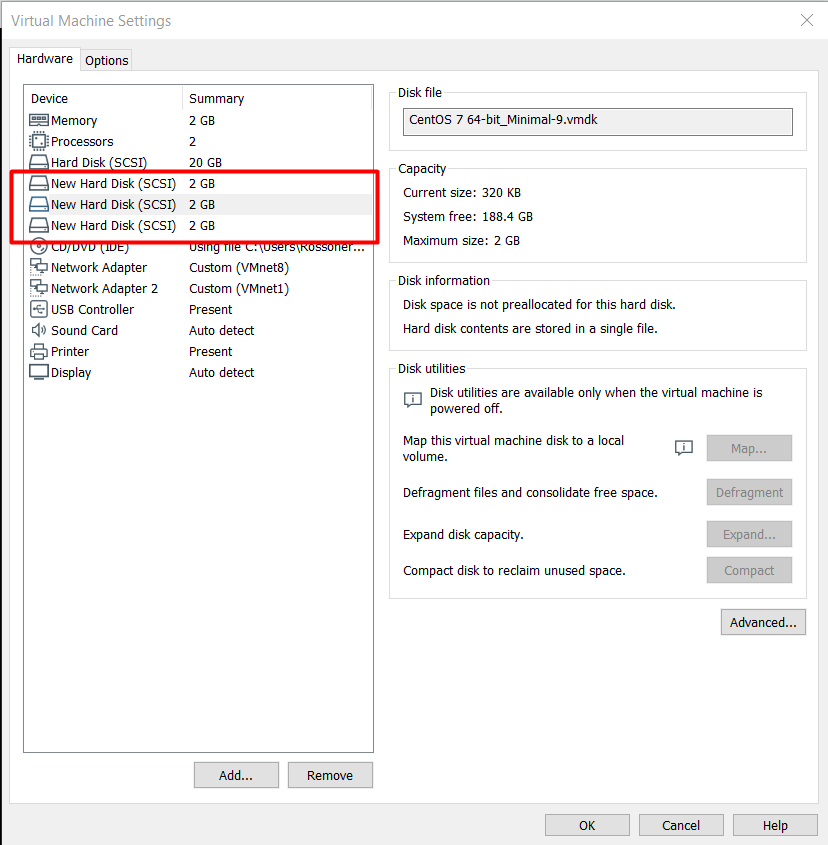

# TÌM HIỂU VỀ LVM   

  


 ## 1. Định nghĩa :    
Logical Volume Manager (LVM) là phương pháp quản lý các storage device , các logical volume dễ dàng , linh hoạt hơn . Với kỹ thuật Logical Volume Manager (LVM) bạn có thể thay đổi kích thước mà không cần phải sửa lại partition table của OS .  


## 2. Cấu trúc LVM :   

  

LVM phân các lớp trên các ổ cứng vật lý .Bao gồm các thành phần sau :      
- Hard drives – Drives

Thiết bị lưu trữ dữ liệu, ví dụ như trong linux nó là /dev/sda

- Partition

Partitions là các phân vùng của Hard drives, mỗi Hard drives có 4 partition, trong đó partition bao gồm 2 loại là primary partition và extended partition.  

 Primary partition: Phân vùng chính, có thể khởi động , mỗi đĩa cứng có thể có tối đa 4 phân vùng này.  

Extended partition: Phân vùng mở rộng

- Physical Volumes:    
   - Kí hiệu : pv...  
   - Là những thành phần cơ bản được sử dụng bởi LVM dể xây dựng lên các tầng cao hơn . Một Physical Volume không thể mở rộng ra ngoài phạm vi một ổ đĩa. Chúng ta có thể kết hợp nhiều Physical Volume thành Volume Groups   
   - Volume Group

Nhiều Physical Volume trên những ổ đĩa khác nhau được kết hợp lại thành một Volume Group

- Volume Group được sử dụng để tạo ra các Logical Volume, trong đó người dùng có thể tạo, thay đổi kích thước, lưu trữ, gỡ bỏ và sử dụng.


  


- 1 Volume group bao gồm nhiều các Physical Volume gộp thành .Các LE được cấp bởi các PE của các Physical Volume , Một Logical Volume là một ánh xạ mà LVM duy trì giữa các Logical và Physical extent.  
**Lưu ý :**  
>Extent trên Physical Volume được gọi là Physical extent.  
>Extent trên Logical Volume được gọi là các Logical extent.

- Logical Volumes:   

  - Kí hiệu: lv...(có thể là lvm... trong hệ thống)  
  - Có chức năng là các phân vùng trong ổ cứng vật lý , nhưng có thể linh hoạt hơn.Là thành phần chính để người dùng và các phần mềm tương tác .  

  

## 3. Cài đặt LVM :  
-  Cấu hình :  
      - Tạo máy ảo CentOS7 trên VMWare.  
      - Add thêm 3 ổ cứng ảo vào .  

  
  
  - Sau khi add xong khởi động lại máy ảo , kiểm tra xem máy đã nhận 3 ổ ảo chưa bằng lệnh  

  ```
  lsblk
  ```  
  

   -  Tạo Logical Volume :  
       - Tạo các Partition :  
       Tạo các partition cho các ổ mới , bắt đầu từ sdb với lệnh  

```
fdisk /dev/sdb
```  
  

   - Trong đó :  

      > - Command n để bắt đầu tạo partition.    
      > - Chọn p để tạo partition primary    
      > - Chọn 1 để đặt partition number    
      > - First sector để mặc định    
      > - Last sector để +1G (có các tùy chọn KB, MB ,GB)    
      > - Sau khi hoàn thành các bước trên nhấn t để đổi định dạng partition    
      > - Chọn 8e để thay đổi định dạng partition   
   
   - Sau khi hoàn thành ấn w để lưu và thoát  
   
   Tương tự tạo thêm các partition primary từ sdb ,sdc,sdd.  
 

  - Tạo Physical Volum :

   Từ các partition /dev/sdb1 /dev/sdc1 /dev/sdd1  ta tạo các Physical Volume bằng lệnh sau :  

   ```
   pvcreate /dev/sdb1    
   pvcreate /dev/sdc1    
   pvcreate /dev/sdd1    
   ```   

   Kiểm tra bằng lệnh `pvs` hoặc `pvdisplay` xem các physical volume đã được tạo chưa  


   - Tạo Volume group: 

 Sau khi tạo các Physical Volume ta gộp các PV đó thành 1 Volume Group bằng lệnh sau   

 ```
 vgcreate vg-demo1 /dev/sdb1 /dev/sdc1 /dev/sdd1
 ```    

 Dùng các lệnh `vgs` hoặc `vgdisplay` để kiểm tra  
  
 - Tạo Logical Volume  
 Từ một Volume group , ta tạo các Logical Volume để sử dụng bằng lệnh sau :  
 ```
 lvcreate -L 1G -n lv-demo1 vg-demo1
 ```  
 Trong đó :  
   >-L : Chỉ ra dung lượng của logical volume  
   -n : Chỉ ra tên của logical volume 
   
Kiểm tra bằng lệnh `lvs` hoặc `lvdisplay`  
  

- Định dạng Logical Volume  
Format các Logical Volume thành các định dạng ext2,ext3,ext4,... :  
```
mkfs -t ext4 /dev/vg-demo1/lv-demo1  
```  
  
- Mount và sử dụng :  

Ta tạo một thư mục để mount Logical Volume :  
```
mkdir demo1  
```  
Tiến hành mount logical volume lv-demo1 vào thư mục demo1  
```
mount /dev/vg-demo1/lv-demo1 demo1
```  
Kiểm tra bằng lệnh 
```
df -h
```   
  
 


