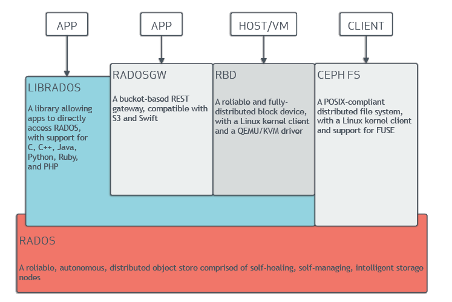
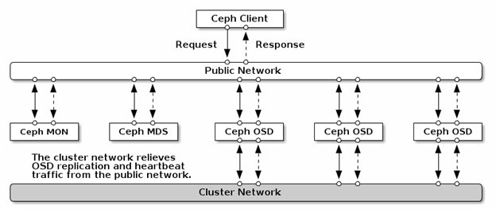

# TÌM HIỂU VỀ CEPH
1. Tìm hiểu chung :  
Ceph là giải pháp mã nguồn mở để xây dựng hạ tầng lưu trữ phân tán, ổn định, hiệu năng cao. Nền tảng của Ceph là Object từ đó hình thành nên các dạng lưu trữ khối (Block), tệp dữ liệu (File). Định dạng dữ liệu block, file đều đc lưu dưới dạng object trong placement group của Ceph cluster.

Tính năng:

    Thay thế lưu trữ trên ổ đĩa server thông thường
    Backup, dự phòng
    Triển khai các dịch vụ High Avaibility như Load Balancing for Web Server, DataBase Replication…
    Giải quyết bài toán lưu trữ cho điện toán đám mây
    Khả năng mở rộng, sử dụng nhiều phần cứng khác nhau
    Ko tồn tại "single point of failure" 

1.1. Kiến trúc :  

  

1.2. Mô hình mạng :   

2. Chi tiết kiến trúc :  
## 2.1. RADOS :  
RADOS (Reliable Autonomic Distributed Object Store) là trái tim của hệ thống lưu trữ CEPH. RADOS cung cấp tất cả các tính năng của Ceph, gồm lưu trữ object phân tán, sẵn sàng cao, tin cậy, không có SPOF, tự sửa lỗi, tự quản lý,... lớp RADOS giữ vai trò đặc biệt quan trọng trong kiến trúc Ceph. Các phương thức truy xuất Ceph, như RBD, CephFS, RADOSGW và librados, đều hoạt động trên lớp RADOS. Khi Ceph cluster nhận một yêu cầu ghi từ người dùng, thuật toán CRUSH (Controlled, scalable, decentralized placement of replicated data) tính toán vị trí và thiết bị mà dữ liệu sẽ được ghi vào. Các thông tin này được đưa lên lớp RADOS để xử lý. Dựa vào quy tắc của CRUSH, RADOS phân tán dữ liệu lên tất cả các node dưới dạng object, các object này được lưu tại các OSD.

RADOS, khi cấu hình với số nhân bản nhiều hơn hai, sẽ chịu trách nhiệm về độ tin cậy của dữ liệu. Nó sao chép object, tạo các bản sao và lưu trữ tại các zone khác nhau, do đó các bản ghi giống nhau không nằm trên cùng 1 zone. RADOS đảm bảo có nhiều hơn một bản copy của object trong RADOS cluster. RADOS cũng đảm bảo object luôn nhất quán. Trong trường hợp object không nhất quán, tiến trình khôi phục sẽ chạy. Tiến trình này chạy tự động và trong suốt với người dùng, do đó mang lại khả năng tự sửa lỗi và tự quẩn lý cho Ceph. RADOS có 2 phần: phần thấp không tương tác trực tiếp với giao diện người dùng, và phần cao hơn có tất cả giao diện người dùng.

RADOS có 2 thành phần chính là OSD và Monitor.

### OSD (Object storage devices ):  
Một Ceph cluster bao gồm nhiều OSD. Ceph lưu trữ dữ liệu dưới dạng object trên các ổ đĩa vật lý.

Object

Với các tác vụ đọc hoặc ghi, client gửi yêu cầu tới node monitor để lấy cluster map sau đó tương tác trực tiếp với OSD ko cần sự can thiệp của monitor.

Object được phân tán lưu trên nhiều OSD, mỗi OSD là primary OSD cho một số object và là secondary OSD cho object khác để tăng tính sẵn sàng và khả năng chống chịu lỗi. Khi primary OSD bị lỗi thì secondary OSD được đẩy lên làm primary OSD. Quá trình này trong suốt với ngưới dùng.

### Ceph OSD File System

Ceph OSD gồm ổ cứng vật lý, Linux filesystem trên nó và Ceph OSD Service. Linux filesystem của Ceph cần hỗ trợ extended attribute (XATTRs). Các thuộc tính của filesystem này cung cấp các thông tin về trạng thái object, metadata, snapshot và ACL cho Ceph OSD daemon, hỗ trợ việc quản lý dữ liêu. LinuxFileSystem có thể là Btrfs, XFS hay Ext4. Sự khác nhau giữa các filesystem này như sau:

    Btrfs: filesystem này cung cấp hiệu năng tốt nhất khi so với XFS hay ext4. Các ưu thế của Btrfs là hỗ trợ copy-on-write và writable snapshot, rất thuận tiện khi cung cấp VM và clone. Nó cũng hỗ trợ nén và checksum, và khả năng quản lý nhiều thiết bị trên cùng môt filesystem. Btrfs cũng hỗ trợ XATTRs, cung cấp khả năng quản lý volume hợp nhất gồm cả SSD, bổ xung tính năng fsck online. Tuy nhiên, btrfs vẫn chưa sẵn sàng để production.
    XFS: Là filesystem đã hoàn thiện và rất ổn định, và được khuyến nghị làm filesystem cho Ceph khi production. Tuy nhiên, XFS không thế so sánh về mặt tính năng với Btrfs. XFS có vấn đề về hiệu năng khi mở rộng metadata, và XFS là một journaling filesystem, có nghĩa, mỗi khi client gửi dữ liệu tới Ceph cluster, nó sẽ được ghi vào journal trước rồi sau đó mới tới XFS filesystem. Nó làm tăng khả năng overhead khi dữ liệu được ghi 2 lần, và làm XFS chậm hơn so với Btrfs, filesystem không dùng journal.
    Ext4: Là một filesystem dạng journaling và cũng có thể sử dụng cho Ceph khi production; tuy nhiên, nó không phôt biến bằng XFS. Ceph OSD sử dụng extended attribute của filesystem cho các thông tin của object và metadata. XATTRs cho phép lưu các thông tin liên quan tới object dưới dạng xattr_name và xattr_value, do vậy cho phép tagging object với nhiều thông tin metadata hơn. ext4 file system không cung cấp đủ dung lượng cho XATTRs do giới hạn về dung lượng bytes cho XATTRs. XFS có kích thước XATTRs lớn hơn.

### Ceph OSD Journal

Ceph dùng các journaling filesystem là XFS cho OSD. Trước khi commit dữ liệu vào backing store, Ceph ghi dữ liệu vào một vùng lưu trữ tên là journal trước, vùng này hoạt động như là một phân vùng đệm (buffer), Journal nằm cùng hoặc khác đĩa với OSD, trên một SSD riêng hoặc một phân vùng, thậm chí là một file riêng trong filesystem. Với cơ chế này, Ceph ghi mọi thứ vào journal, rồi mới ghi vào backing storage.

Một dữ liệu ghi vào journal sẽ được lưu tại đây trong lúc syncs xuống backing store, mặc định là 5 giây chạy 1 lần. 10 GB là dung lượng phổ biến của journal, tuy nhiên journal càng lớn càng tốt. Ceph dùng journal để tăng tốc và đảm bảo tính nhất quán. Journal cho phép Ceph OSD thực hiện các tác vụ ghi nhỏ nhanh chóng; một tác vụ ghi ngẫu nhiên sẽ được ghi xuống journal theo kiểu tuần tự, sau đó được flush xuống filesystem. Điều này cho phép filesystem có thời gian để gộp các tác vụ ghi vào ổ đĩa. Hiệu năng sẽ tăng lên rõ rệt khi journal được tạo trên SSD.

Khuyến nghị, không nên vượt quá tỉ lệ 5 OSD/1 Journal disk khi dùng SSD làm journal. Khi SSD Journal bị lỗi, toàn bộ các OSD có journal trên SSD đó sẽ bị lỗi. Với Btrfs, việc này sẽ không xảy ra, bởi Btrfs hỗ trợ copy-on-write, chỉ ghi xuống các dữ liệu thay đổi, mà không tác động vào dữ liệu cũ, khi journal bị lỗi, dữ liệu trên OSD vẫn tồn tại.

### 1.3. Ceph Disk

Mặc định Ceph đã có khả năng nhân bản để bảo vệ dữ liệu, do đó không cần làm RAID với các dữ liệu đã được nhân bản đó.

Phương pháp nhân bản dữ liệu của Ceph khong yêu câu một ổ cứng trống cùng dung lượng ổ hỏng. Nó dùng đường truyền mạng để khôi phục dữ liệu trên ổ cứng lỗi từ nhiều node khác. Trong quá trình khôi phục dữ liệu, dựa vào tỉ lệ nhân bản và số PGs(Placement Group), hầu như toàn bộ các node sẽ tham gia vào quá trình khôi phục, giúp quá trình này diễn ra nhanh hơn.

##  CEPH MONITOR 

Ceph monitor chịu trách nhiệm giám sát tình trạng của toàn hệ thống. Nó hoạt động như các daemon duy trì sự kết nối trong cluster bằng cách chứa các thông tin cơ bản về cluster, tình trạng các node lưu trữ và thông tin cấu hình cluster. Ceph monitor thực hiện điều này bằng cách duy trì các cluster map. Các cluster map này bao gồm monitor, OSD, PG, CRUSH và MDS map.

    Monitor map: map này lưu giữ thông tin về các node monitor, gồm CEPH Cluster ID, monitor hostname, địa chỉ IP và số port. Nó cũng giữ epoch (phiên bản map tại một thời điểm) hiện tại để tạo map và thông tin về lần thay đổi map cuối cùng.
    OSD map: map này lưu giữ các trường như cluster ID, epoch cho việc tạo map OSD và lần thay đổi cuối., và thông tin liên quan đến pool như tên, ID, loại, mức nhân bản và PG. Nó cũng lưu các thông tin OSD như tình trạng, trọng số, thông tin host OSD.
    PG map: map này lưu giữ các phiên bản của PG (thành phần quản lý các object trong ceph), timestamp, bản OSD map cuối cùng, tỉ lệ đầy và gần đầy dung lượng. Nó cũng lưu các ID của PG, object count, tình trạng hoạt động và srub (hoạt động kiểm tra tính nhất quán của dữ liệu lưu trữ).
    CRUSH map: map này lưu các thông tin của các thiết bị lưu trữ trong Cluster, các rule cho tưng vùng lưu trữ.
    MDS map: lưu thông tin về thời gian tạo và chỉnh sửa, dữ liệu và metadata pool ID, cluster MDS count, tình trạng hoạt động của MDS, epoch của MDS map hiện tại.

Hướng triển khai MON:

Ceph monitor không lưu trữ dũ liệu, thay vào đó, nó gửi các bản update cluster map cho client và các node khác trong cluster. Client và các node khác định kỳ check các cluster map với monitor node.

Monitor là lightweight daemon không yêu cầu nhiều tài nguyên tính toán. Một Server thuộc dòng entry-server, CPU, RAM vừa phải và card mạng 1 GbE là đủ. Monitor node cần có đủ không gian lưu trữ để chứa các cluster logs, gồm OSD, MDS và monitor log. Một cluster ổn định sinh ra lượng log từ vài MB đến vài GB. Tuy nhiên, dung lượng cho log có thể tăng lên khi mức độ debug bị thay đổi, có thể lên đến một vài GB.

Số monitor trong hệ thống nên là số lẻ, ít nhất là 1 node, và khuyến nghị là 3 node. Một monitor node sẽ là leader, và các node còn lại sẽ đưa đưa lên làm leader nếu node ban đầu bị lỗi.

Monitor daemon có thể chạy cùng trên OSD node. Tuy nhiên, cần trang bị nhiều CPU, RAM và ổ cứng hơn để lưu monitor logs. Đối với các hệ thống lớn, nên sử dụng node monitor chuyên dụng

## 2.2 LIBRADOS:  
Librados là thư viện C cho phép ứng dụng làm việc trực tiếp với RADOS, bypass qua các lớp khác để tương tác với Ceph Cluste.librados là thư viện cho RADOS, cung cấp các hàm API, giúp ứng dụng tương tác trực tiếp và truy xuất song song vào cluster.Ứng dụng có thể mở rộng các giao thức của nó để truy cập vào RADOS bằng cách sử dụng librados. Các thư viện tương tự cũng sẵn sàng cho C++, Java, Python, Ruby, PHP. librados là nền tảng cho các service giao diện khác chạy bên trên, gồm Ceph block device, Ceph filesystem, Ceph RADOS Gateway. librados cung cấp rất nhiều API, các phương thức lưu trữ key/value trong object. API hỗ trợ atomic-single-object bằng cách update dữ liệu, key và các thuộc tính.

1. Ceph Block Storage Device

Ceph Block Device có tên là RADOS block device (RBD); cung cấp block storage cho hypervisor và máy ảo. Ceph RBD driver được tích hợp với Linux kernel (từ bản 2.6.39) và hỗ trợ QEMU/KVM.

Khi Ceph block device được map vào máy chủ Linux, nó có thể được sử dụng như một phân vùng RAW hoặc cố thể định dạng theo các loại filesystem phổ biến.

Ceph đã được tích hợp chặt chẽ với các nền tảng Cloud như OpenStack. Ceph cung cấp backend là block device để lưu trữ volume máy ảo và OS image choCinder và Glance. Các volume và image này là thin provisioned, có nghĩa chỉ lưu trữ các dữ liệu object bị thay đổi, giúp tiết kiệm tài nguyên lưu trữ.

Tính năng copy-on-write và cloning của Ceph giúp OpenStack tạo hàng trăm máy ảo trong thời gian ngắn. RBD cũng hỗ trợ snapshot, giúp lưu giữ trạng thái máy ảo, dùng để khôi phục máy ảo lại môt thời điểm hoặc để tạo ra một máy ảo khác tương tự. Ceph cũng là backend cho máy ảo, giúp di chuyển máy ảo giữa các node Compute bởi tất cả dữ liệu máy ảo đều nằm trên Ceph. Các hypervisor như QEMY, KVM, XEN có thể boot máy ảo từ volume nằm trên Ceph.

RBD sử dụng thư viện librbd để tận dụng các tiện ích của RADOS và cung cấp tính tin cậy, phân tán và khả năng lưu trữ dựa trên object.RBD hỗ trợ update vào các object. Client có thể ghi, nối thêm, cắt xén vào các object đang có. Do đó RBD là giải pháp lưu trữ tối ưu cho volume máy ảo.

##1.1. Snapshot

Ceph hỗ trợ snapshot layering, nó cho phép clone image nhanh chóng và dễ dàng. Ceph hỗ trợ block device snapshots bằng rbd command và interfaces.

Để sử dụng RBD snapshots, ta cần chạy Ceph cluster. Khuyến cáo nên dừng I/O trước khi snapshot. We recommend to stop I/O before taking a snapshot of an image. If the image contains a filesystem, the filesystem must be in a consistent state before taking a snapshot. To stop I/O you can use fsfreeze command.

##1.2. Layering

Ceph hỗ trợ khả năng copy-on-write(COW) clone of a block device snapshot.

Mỗi cloned image(child) tham chiếu tới parent image, nó cho phép mở parent snapshot và đọc snapshot.

Note: Ceph chỉ hỗ trợ cloning định dạng images 2 ( rbd create --image-format 2)

Các bản cloned image có tham chiếu tới parent shapshot, bao gồm pool ID, image ID, snapshot ID. Có thể clone snapshot từ pool này sang pool khác.

    Image Template: Sử dụng block device layering để tạo master image và snapshot mẫu phục vụ cho việc clone.
    Extended Template: Cung cấp khả năng mở rộng cho image mẫu để cung cấp nhiều thông tin hơn base image.
    Tempate Pool: Sử dụng block device layering để tạo pool chứa master images và snapshot mẫu.
    Image Migration/Recovery: Sử dụng block device layering để migrate or recover data từ pool này sang pool khác. 

##1.3. RBD Mirroring

RBD images có thể mirrored trên 2 cụm Ceph cluster thông qua RBD journaling image. Mirroring đc cấu hình trên các pool trong peer cluster và có thể cấu hình tự động mirror tất cả các images trong 1 pool hoặc 1 nhóm images.

RBD mirroring requires the Ceph Jewel release, must have two Ceph clusters, each running the rbd-mirror daemon

http://docs.ceph.com/docs/master/rbd/rbd-mirroring/

##1.4. Cache Settings

Ceph block device ko thể sử dụng page cache của linux vì vậy nó có 1 thành phần là RBD caching hoạt động giống như là ổ đĩa caching.

http://docs.ceph.com/docs/hammer/rbd/rbd-config-ref/

##1.5. Block Devices and OpenStack

Ta có thể sử dụng Ceph Block Device images với OpenStack thông qua libvirt

Ba thành phần của OpenStack tích hợp với Ceph block device:

    Image
    Volume
    Guest disk: là một operating system disk. Trước bản Havana, ta khởi động một máy ảo thông qua volume của Cinder. Hiện nay có thể khởi động máy ảo bên trong Ceph mà ko cần Cinder. 

Ceph doesn’t support QCOW2. Image format must be RAW.

http://docs.ceph.com/docs/master/rbd/rbd-openstack/

##2. Ceph Object Gateway

Ceph Object Gateway, hay RADOS Gateway, là một proxy chuyển các request HTTP thành các RADOS request và ngược lại, cung cấp RESTful object storage, tương thích với S3 và Swift. Ceph Object Storage sử dụng Ceph Object Gateway Daemon (radosgw) để tương tác với librgw và Ceph cluster, librados. Nó sử dụng một module FastCGI là libfcgi, và có thể sử dụng với bất cứ Server web tương thích với FASTCGI nào. Ceph Object Store hỗ trợ 3 giao diện sau:

    S3: Cung cấp Amazon S3 RESTful API.
    Swift: Cung cấp OpenStack Swift API. Ceph Object Gateway có thể thay thê Swift.
    Admin: Hỗ trợ quản trị Ceph Cluster thông qua HTTP RESTful API.

##3. CephFS

Ceph Filesystem (CephFS) là một POSIX-compliant filesystem sử dụng Ceph Storage Cluster để lưu data. CephFS kế thừa các tính năng từ RADOS.

Để sử dụng CephFS cần một Ceph MDS hay Metadata Server là daemon cho Ceph filesystem (CephFS). MDS là thành phần duy nhất trong ceph chưa production, hiện chỉ 1 ceph MDS daemon hoạt động tại 1 thời điểm. MDS không lưu dữ liệu local. Nếu 1 MDS daemon lỗi, ta có thể tạo lại trên bất cứ hệ thống nào mà cluster có thể truy cập. Các metadata server daemon được cấu hình là active-passive. Primary MDS là acive, còn các node khác chạy standby.

Thư viện libcephfs hỗ trợ Linux kernel driver, người dùng có thể dùng phương thức mounting filesystem qua lệnh mount. Nó hỗ trợ CIFS và SMB. CephFS hỗ trợ filesystem in userspace(FUSE) dùng module cephfuse. Nó cũng hỗ trợ ứng dụng tương tác trực tiếpvới RADOS cluster dùng thư viện libcephfs.
