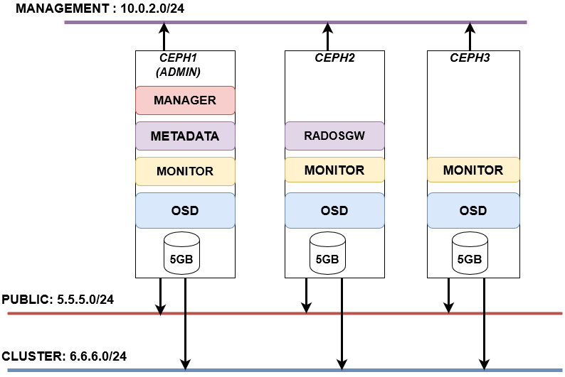

# CEPH STORAGE (VER NAUTILUS)

## MỤC LỤC : 
### 1.Kiến trúc :  
### 2.Ưu , nhược :  
### 3.Cấu hình lab :  
### 4.Cài đặt và quản lý :  

------------------------------

## 3. CẤU HÌNH LAB :  
- SƠ ĐỒ :  


- Cấu hình : 
  - 3 máy ảo ,

## 4. CÀI ĐẶT VÀ QUẢN LÝ :  
## 4.1. CÀI ĐẶT :  
## 4.1.1. CÀI ĐẶT CHO CLUSTER :  
## Thiết lập hostname, IP cho node CEPH1 : 

- Login với tài khoản root và thực hiện các lệnh dưới.

```
yum update -y
```
- Cài đặt các gói phần mềm bổ trợ :
```
yum install epel-release -y
yum update -y
yum install wget byobu curl git byobu python-setuptools python-virtualenv -y
```
- Thiết lập hostname cho CEPH1
```
hostnamectl set-hostname ceph1
```
- Thiết lập IP Add, trong hướng dẫn này, VLAN 192.168.98.0/24 sẽ ra internet để tải các gói cài đặt.
```
echo "Setup IP  eth0"
nmcli con modify eth0 ipv4.addresses 192.168.98.85/24
nmcli con modify eth0 ipv4.gateway 192.168.98.1
nmcli con modify eth0 ipv4.dns 8.8.8.8
nmcli con modify eth0 ipv4.method manual
nmcli con mod eth0 connection.autoconnect yes

echo "Setup IP  eth1"
nmcli con modify eth1 ipv4.addresses 192.168.62.85/24
nmcli con modify eth1 ipv4.method manual
nmcli con mod eth1 connection.autoconnect yes

echo "Setup IP  eth2"
nmcli con modify eth2 ipv4.addresses 192.168.63.85/24
nmcli con modify eth2 ipv4.method manual
nmcli con mod eth2 connection.autoconnect yes
```
- Cấu hình chế độ firewall để tiện trong môi trường lab. Trong môi trường production cần bật firewall hoặc iptables hoặc có biện pháp xử lý khác tương ứng để đảm bảo các vấn đề về an toàn.
```
sudo systemctl disable firewalld
sudo systemctl stop firewalld
sudo systemctl disable NetworkManager
sudo systemctl stop NetworkManager
sudo systemctl enable network
sudo systemctl start network

sed -i 's/SELINUX=enforcing/SELINUX=disabled/g' /etc/sysconfig/selinux
sed -i 's/SELINUX=enforcing/SELINUX=disabled/g' /etc/selinux/config

echo "net.ipv6.conf.all.disable_ipv6 = 1" >> /etc/sysctl.conf
```
 
- Khai báo file /etc/hosts. Việc này rất quan trọng vì CEPH sẽ sử dụng hostname trong các bước tới để cấu hình và kết nối khi thực hiện.
```
vi /etc/hosts
127.0.0.1 ceph1 localhost
5.5.5.9 ceph1
5.5.5.8 ceph3
5.5.5.7 ceph2
5.5.5.4 client1

10.0.2.7 ceph1
10.0.2.5 ceph3
10.0.2.6 ceph2
10.0.2.15 client1
```
- Cài đặt NTP, trong hướng dẫn này sử dụng chronyd thay cho ntpd. Việc đồng bộ thời gian cũng là quan trọng khi triển khai CEPH. Hãy đảm bảo timezone và thời gian được đồng bộ để đúng với hệ thống của bạn.
```
yum install -y chronyd

systemctl enable chronyd.service
systemctl start chronyd.service
systemctl restart chronyd.service
chronyc sources
```


- Khởi động lại node CEPH1 và chuyển sang CEPH2 thực hiện tiếp.
```
init 6
```
## THIẾT LẬP IP , HOSTNAME CHO NODE CEPH2 : 

- Login với tài khoản root và thực hiện các lệnh dưới.

- Cập nhật các gói phần mềm.
```
yum update -y
```
- Cài đặt các gói phần mềm bổ trợ
```
yum install epel-release -y
yum update -y
yum install wget byobu curl git byobu python-setuptools python-virtualenv -y
```
- Thiết lập hostname cho CEPH2
```
hostnamectl set-hostname ceph2
```
- Thiết lập IP Add, trong hướng dẫn này, VLAN 192.168.98.0/24 sẽ ra internet để tải các gói cài đặt.
```
echo "Setup IP  eth0"
nmcli con modify eth0 ipv4.addresses 192.168.98.86/24
nmcli con modify eth0 ipv4.gateway 192.168.98.1
nmcli con modify eth0 ipv4.dns 8.8.8.8
nmcli con modify eth0 ipv4.method manual
nmcli con mod eth0 connection.autoconnect yes

echo "Setup IP  eth1"
nmcli con modify eth1 ipv4.addresses 192.168.62.86/24
nmcli con modify eth1 ipv4.method manual
nmcli con mod eth1 connection.autoconnect yes

echo "Setup IP  eth2"
nmcli con modify eth2 ipv4.addresses 192.168.63.86/24
nmcli con modify eth2 ipv4.method manual
nmcli con mod eth2 connection.autoconnect yes
```
- Cấu hình chế độ firewall để tiện trong môi trường lab. Trong môi trường production cần bật firewall hoặc iptables hoặc có biện pháp xử lý khác tương ứng để đảm bảo các vấn đề về an toàn.
```
sudo systemctl disable firewalld
sudo systemctl stop firewalld
sudo systemctl disable NetworkManager
sudo systemctl stop NetworkManager
sudo systemctl enable network
sudo systemctl start network

sed -i 's/SELINUX=enforcing/SELINUX=disabled/g' /etc/sysconfig/selinux
sed -i 's/SELINUX=enforcing/SELINUX=disabled/g' /etc/selinux/config

echo "net.ipv6.conf.all.disable_ipv6 = 1" >> /etc/sysctl.conf
```
- Khai báo file /etc/hosts. Việc này rất quan trọng vì CEPH sẽ sử dụng hostname trong các bước tới để cấu hình và kết nối khi thực hiện.
```
vi /etc/hosts
127.0.0.1 ceph2 localhost
5.5.5.9 ceph1
5.5.5.8 ceph3
5.5.5.7 ceph2
5.5.5.4 client1

10.0.2.7 ceph1
10.0.2.5 ceph3
10.0.2.6 ceph2
10.0.2.15 client1
```
- Cài đặt NTP, trong hướng dẫn này sử dụng chronyd thay cho ntpd. Việc đồng bộ thời gian cũng là quan trọng khi triển khai CEPH. Hãy đảm bảo timezone và thời gian được đồng bộ để đúng với hệ thống của bạn.
```
yum install -y chronyd

systemctl enable chronyd.service
systemctl start chronyd.service
systemctl restart chronyd.service
chronyc sources
```

- Khởi động lại node CEPH2 và chuyển sang CEPH3 thực hiện.
```
init 6
```
##  THIẾT LẬP HOSTNAME,IP CHO NODE CEPH3:

- Login với tài khoản root và thực hiện các lệnh dưới.

- Cập nhật các gói phần mềm.
```
yum update -y
```
- Cài đặt các gói bổ trợ
```
yum install epel-release -y
yum update -y
yum install wget byobu curl git byobu python-setuptools python-virtualenv -y
```
- Thiết lập hostname cho CEPH3
```
hostnamectl set-hostname ceph3
```
- Thiết lập IP Add, trong hướng dẫn này, VLAN 192.168.98.0/24 sẽ ra internet để tải các gói cài đặt.
```
echo "Setup IP  eth0"
nmcli con modify eth0 ipv4.addresses 192.168.98.87/24
nmcli con modify eth0 ipv4.gateway 192.168.98.1
nmcli con modify eth0 ipv4.dns 8.8.8.8
nmcli con modify eth0 ipv4.method manual
nmcli con mod eth0 connection.autoconnect yes

echo "Setup IP  eth1"
nmcli con modify eth1 ipv4.addresses 192.168.62.87/24
nmcli con modify eth1 ipv4.method manual
nmcli con mod eth1 connection.autoconnect yes

echo "Setup IP  eth2"
nmcli con modify eth2 ipv4.addresses 192.168.63.87/24
nmcli con modify eth2 ipv4.method manual
nmcli con mod eth2 connection.autoconnect yes
```

- Cấu hình chế độ firewall để tiện trong môi trường lab. Trong môi trường production cần bật firewall hoặc iptables hoặc có biện pháp xử lý khác tương ứng để đảm bảo các vấn đề về an toàn.
```
sudo systemctl disable firewalld
sudo systemctl stop firewalld
sudo systemctl disable NetworkManager
sudo systemctl stop NetworkManager
sudo systemctl enable network
sudo systemctl start network

sed -i 's/SELINUX=enforcing/SELINUX=disabled/g' /etc/sysconfig/selinux
sed -i 's/SELINUX=enforcing/SELINUX=disabled/g' /etc/selinux/config

echo "net.ipv6.conf.all.disable_ipv6 = 1" >> /etc/sysctl.conf
```
- Khai báo file /etc/hosts. Việc này rất quan trọng vì CEPH sẽ sử dụng hostname trong các bước tới để cấu hình và kết nối khi thực hiện.
```
vi /etc/hosts
127.0.0.1 ceph3 localhost
5.5.5.9 ceph1
5.5.5.8 ceph3
5.5.5.7 ceph2
5.5.5.4 client1

10.0.2.7 ceph1
10.0.2.5 ceph3
10.0.2.6 ceph2
10.0.2.15 client1
```
- Cài đặt NTP, trong hướng dẫn này sử dụng chronyd thay cho ntpd. Việc đồng bộ thời gian cũng là quan trọng khi triển khai CEPH. Hãy đảm bảo timezone và thời gian được đồng bộ để đúng với hệ thống của bạn.
```
yum install -y chronyd

systemctl enable chronyd.service
systemctl start chronyd.service
systemctl restart chronyd.service
chronyc sources
```


- Khởi động lại node CEPH2 và chuyển sang CEPH1 thực hiện các cấu hình tiếp theo. Login với các IP đã đặt cho CEPH trước đó.


## TẠO USER CÀI ĐẶT CEPH VÀ KHAI BÁO REPO:
### TẠO USER CÀI ĐẶT TRÊN CẢ 3 NODE CEPH1,CEPH2,CEPH3 :

- Bước này được thực hiện trên cả 03 node CPEH.

- Tạo user là cephuser với mật khẩu là matkhau2019@
```
useradd cephuser; echo 'matkhau2019@' | passwd cephuser --stdin
```
- Cấp quyền sudo cho user cephuser
```
echo "cephuser ALL = (root) NOPASSWD:ALL" | sudo tee /etc/sudoers.d/cephuser
chmod 0440 /etc/sudoers.d/cephuser
```
- Khai báo repo cho ceph nautilus , thực hiện hiện khai báo repo cho ceph nautilus trên tất cả các node CEPH.
```
cat <<EOF> /etc/yum.repos.d/ceph.repo
[ceph]
name=Ceph packages for $basearch
baseurl=https://download.ceph.com/rpm-nautilus/el7/x86_64/
enabled=1
priority=2
gpgcheck=1
gpgkey=https://download.ceph.com/keys/release.asc

[ceph-noarch]
name=Ceph noarch packages
baseurl=https://download.ceph.com/rpm-nautilus/el7/noarch
enabled=1
priority=2
gpgcheck=1
gpgkey=https://download.ceph.com/keys/release.asc

[ceph-source]
name=Ceph source packages
baseurl=https://download.ceph.com/rpm-nautilus/el7/SRPMS
enabled=0
priority=2
gpgcheck=1
gpgkey=https://download.ceph.com/keys/release.asc
EOF
```
- Thực hiện update sau khi khai bao repo
```
yum update -y
```
### CÀI ĐẶT CEPH DEPLOY VÀ CẤU HÌNH 
- Cài đặt ceph-deploy , thực hiện việc cài đặt này trên node CEPH1

- Trong một số mô hình, node cài đặt ceph-deploy được gọi là node admin. Trong hướng dẫn này, ta sẽ sử dụng node ceph1 chính là node ceph admin. Thực hiện việc này bằng tài khoản root.  


> Lưu ý :  trong hướng dẫn này chỉ cần đứng trên ceph1 thực hiện, một số thao tác trên node CEPH2, CEPH3 sẽ thực hiện từ xa ngay trên CEPH1 .  

```
sudo yum install -y epel-release
sudo yum install -y ceph-deploy
```
- Chuyển sang tài khoản cephuser
```
su - cephuser
```
- Tạo ssh key, sau đó copy sang các node còn lại, nhập mật khẩu của user cephuser ở trên khi được hỏi tại màn hình. Lưu ý không dùng sudo với lệnh ssh-keygen
```
ssh-keygen
```

- Nhấn Enter để mặc định các tham số, bước này sẽ sinh ra private key và public key cho user cephuser. Sau đó tiến hành các lệnh dưới để copy public key sang các node.

- Nhập mật khẩu của user cephuser tạo ở các node trước đó trong bước trên.
```
ssh-copy-id cephuser@ceph1

ssh-copy-id cephuser@ceph2

ssh-copy-id cephuser@ceph3
```

- Tạo thư mục chứa các file cấu hình khi cài đặt CEPH
```
cd ~
mkdir my-cluster
cd my-cluster
```
- Khai báo các node ceph trong cluser.
```
ceph-deploy new ceph1 ceph2 ceph3
```

- Lệnh trên sẽ sinh ra các file cấu hình trong thư mục hiện tại, kiểm tra bằng lệnh ls – alh
```
cephuser@ceph1:~/my-cluster$ ls -alh
total 188K
drwxrwxr-x 2 cephuser cephuser   75 Sep  6 23:14 .
drwx------ 5 cephuser cephuser  151 Sep  6 23:14 ..
-rw-rw-r-- 1 cephuser cephuser  418 Sep  6 23:15 ceph.conf
-rw-rw-r-- 1 cephuser cephuser 177K Sep  6 23:19 ceph-deploy-ceph.log
-rw------- 1 cephuser cephuser   73 Sep  6 23:14 ceph.mon.keyring
```

- Khai báo thêm các tùy chọn cho việc triển khai, vận hành CEPH vào file ceph.conf này trước khi cài đặt các gói cần thiết cho ceph trên các node. Lưu ý các tham số về network.

- Ta sẽ dụng vlan 192.168.62.0/24 cho đường truy cập của các client (Hay gọi là ceph public. Vlan 192.168.63.0/24 cho đường replicate dữ liệu, các dữ liệu sẽ được sao chép & nhân bản qua vlan này.
```
echo "public network = 192.168.62.0/24" >> ceph.conf
echo "cluster network = 192.168.63.0/24" >> ceph.conf
echo "osd objectstore = bluestore"  >> ceph.conf
echo "mon_allow_pool_delete = true"  >> ceph.conf
echo "osd pool default size = 3"  >> ceph.conf
echo "osd pool default min size = 1"  >> ceph.conf
```
- Bắt đầu cài đặt phiên bản CEPH Nautilus lên các node ceph1, ceph2, ceph3. Lệnh dưới sẽ cài đặt lần lượt lên các node.
```
ceph-deploy install --release nautilus ceph1 ceph2 ceph3
```
- Kết quả của lệnh trên sẽ hiển thị như bên dưới, trong đó có phiên bản của ceph được cài trên các node.
```
.......

[2019-09-06 23:16:46,139][ceph1][INFO  ] Running command: sudo ceph --version
[2019-09-06 23:16:46,262][ceph1][DEBUG ] ceph version 14.2.3 (0f776cf838a1ae3130b2b73dc26be9c95c6ccc39) nautilus (stable)
.......

[2019-09-06 23:18:18,771][ceph2][INFO  ] Running command: sudo ceph --version
[2019-09-06 23:18:18,944][ceph2][DEBUG ] ceph version 14.2.3 (0f776cf838a1ae3130b2b73dc26be9c95c6ccc39) nautilus (stable)
.......

[2019-09-06 23:19:46,856][ceph3][INFO  ] Running command: sudo ceph --version
[2019-09-06 23:19:47,028][ceph3][DEBUG ] ceph version 14.2.3 (0f776cf838a1ae3130b2b73dc26be9c95c6ccc39) nautilus (stable)
```
- Thiết lập thành phần MON cho CEPH. Trong hướng dẫn này khai báo 03 node đều có thành phần MON của CEPH.
```
ceph-deploy mon create-initial
```
- Kết quả sinh ra các file trong thư mục hiện tại
```
cephuser@ceph1:~/my-cluster$ ls -alh
total 348K
drwxrwxr-x 2 cephuser cephuser  244 Sep  6 23:26 .
drwx------ 5 cephuser cephuser  151 Sep  6 23:14 ..
-rw------- 1 cephuser cephuser  113 Sep  6 23:26 ceph.bootstrap-mds.keyring
-rw------- 1 cephuser cephuser  113 Sep  6 23:26 ceph.bootstrap-mgr.keyring
-rw------- 1 cephuser cephuser  113 Sep  6 23:26 ceph.bootstrap-osd.keyring
-rw------- 1 cephuser cephuser  113 Sep  6 23:26 ceph.bootstrap-rgw.keyring
-rw------- 1 cephuser cephuser  151 Sep  6 23:26 ceph.client.admin.keyring
-rw-rw-r-- 1 cephuser cephuser  418 Sep  6 23:15 ceph.conf
-rw-rw-r-- 1 cephuser cephuser 214K Sep  6 23:26 ceph-deploy-ceph.log
-rw------- 1 cephuser cephuser   73 Sep  6 23:14 ceph.mon.keyring
```
- Thực hiện copy file ceph.client.admin.keyring sang các node trong cụm ceph cluster. File này sẽ được copy vào thư mục /etc/ceph/ trên các node.
```
ceph-deploy admin ceph1 ceph2 ceph3
```
- Kết quả của lệnh trên như sau
```
cephuser@ceph1:~/my-cluster$ ceph-deploy admin ceph1 ceph2 ceph3
[ceph_deploy.conf][DEBUG ] found configuration file at: /home/cephuser/.cephdeploy.conf
[ceph_deploy.cli][INFO  ] Invoked (2.0.1): /bin/ceph-deploy admin ceph1 ceph2 ceph3
[ceph_deploy.cli][INFO  ] ceph-deploy options:
[ceph_deploy.cli][INFO  ]  username                      : None
[ceph_deploy.cli][INFO  ]  verbose                       : False
[ceph_deploy.cli][INFO  ]  overwrite_conf                : False
[ceph_deploy.cli][INFO  ]  quiet                         : False
[ceph_deploy.cli][INFO  ]  cd_conf                       : <ceph_deploy.conf.cephdeploy.Conf instance at 0x7f3c031d6248>
[ceph_deploy.cli][INFO  ]  cluster                       : ceph
[ceph_deploy.cli][INFO  ]  client                        : ['ceph1', 'ceph2', 'ceph3']
[ceph_deploy.cli][INFO  ]  func                          : <function admin at 0x7f3c03a77230>
[ceph_deploy.cli][INFO  ]  ceph_conf                     : None
[ceph_deploy.cli][INFO  ]  default_release               : False
[ceph_deploy.admin][DEBUG ] Pushing admin keys and conf to ceph1
[ceph1][DEBUG ] connection detected need for sudo
[ceph1][DEBUG ] connected to host: ceph1
[ceph1][DEBUG ] detect platform information from remote host
[ceph1][DEBUG ] detect machine type
[ceph1][DEBUG ] write cluster configuration to /etc/ceph/{cluster}.conf
[ceph_deploy.admin][DEBUG ] Pushing admin keys and conf to ceph2
[ceph2][DEBUG ] connection detected need for sudo
[ceph2][DEBUG ] connected to host: ceph2
[ceph2][DEBUG ] detect platform information from remote host
[ceph2][DEBUG ] detect machine type
[ceph2][DEBUG ] write cluster configuration to /etc/ceph/{cluster}.conf
[ceph_deploy.admin][DEBUG ] Pushing admin keys and conf to ceph3
[ceph3][DEBUG ] connection detected need for sudo
[ceph3][DEBUG ] connected to host: ceph3
[ceph3][DEBUG ] detect platform information from remote host
[ceph3][DEBUG ] detect machine type
[ceph3][DEBUG ] write cluster configuration to /etc/ceph/{cluster}.conf
```
- Đứng trên node ceph1 phân quyền cho file /etc/ceph/ceph.client.admin.keyring cho cả 03 node.
```
ssh cephuser@ceph1 'sudo chmod +r /etc/ceph/ceph.client.admin.keyring'
ssh cephuser@ceph2 'sudo chmod +r /etc/ceph/ceph.client.admin.keyring'
ssh cephuser@ceph3 'sudo chmod +r /etc/ceph/ceph.client.admin.keyring'
```
### KHAI BÁO CÁC OSD CHO NODE CEPH .

- Đứng trên node ceph1 và thực hiện khai báo các OSD disk. Bước này sẽ thực hiện format các disk trên cả 3 node và join chúng vào làm các OSD (Thành phần chứa dữ liệu của CEPH).
```
ceph-deploy osd create --data /dev/sdb ceph1


ceph-deploy osd create --data /dev/sdb ceph2


ceph-deploy osd create --data /dev/sdb ceph3

```
> Lưu ý :   
> Cần ít nhất 2GB trở lên để tạo osd 

- Tới đây các bước cơ bản cấu hình ceph cluser đã hoàn tất. Kiểm tra trạng thái của cụm cluster ceph bằng lệnh ceph -s . Kết quả lệnh ceph -s sẽ như sau
```
cephuser@ceph1:~/my-cluster$ ceph -s
  cluster:
    id:     9691b2b5-a858-45b7-a239-4de3e1ff69c6
    health: HEALTH_WARN
            no active mgr

  services:
    mon: 3 daemons, quorum ceph1,ceph2,ceph3 (age 4m)
    mgr: no daemons active
    osd: 8 osds: 8 up (since 6s), 8 in (since 6s)

  data:
    pools:   0 pools, 0 pgs
    objects: 0 objects, 0 B
    usage:   0 B used, 0 B / 0 B avail
    pgs:
```

= Ta thấy trạng thái sẽ là HEALTH_WARN, lý do là vì ceph-mgr chưa được enable. Tiếp theo ta sẽ xử lý để kích hoạt ceph-mgr

### Cấu hình manager và dashboad cho ceph cluster

- Ceph-dashboard là một thành phần thuộc ceph-mgr. Trong bản Nautilus thì thành phần dashboard được cả tiến khá lớn. Cung cấp nhiều quyền hạn thao tác với CEPH hơn các bản trước đó (thành phần này được đóng góp chính bởi team SUSE).

- Thực hiện trên node ceph1 việc cài đặt này.

- Trong bản ceph nautilus 14.2.3 (tính đến ngày 06.09.2019), khi cài ceph dashboard theo các cách cũ gặp một vài vấn đề, cách xử lý như sau.

- Cài thêm các gói bổ trợ trước khi cài
```
sudo yum install -y python-jwt python-routes
```
- Tải ceph-dashboad ceph-mgr-dashboard-14.2.4-0.el7.noarch.rpm và ceph-grafana-dashboards-14.2.4-0.el7.noarch.rpm. Lưu ý nên đúng phiên bản với ceph ở trên.
```
sudo rpm -Uvh http://download.ceph.com/rpm-nautilus/el7/noarch/ceph-grafana-dashboards-14.2.4-0.el7.noarch.rpm

sudo rpm -Uvh http://download.ceph.com/rpm-nautilus/el7/noarch/ceph-mgr-dashboard-14.2.4-0.el7.noarch.rpm
```
- Thực hiện kích hoạt ceph-mgr và ceph-dashboard
```
ceph-deploy mgr create ceph1 ceph2 ceph3
 
yum install ceph-mgr-dashboard -y
ceph mgr module enable dashboard
ceph dashboard create-self-signed-cert
ceph mgr services
```

> Lưu ý :  
> - Cài đặt yum install ceph-mgr-dashboard -y trên cả ceph01 và ceph02 ceph3  

- Tạo cert cho ceph-dashboad
```
sudo ceph dashboard create-self-signed-cert 
```
- Kết quả trả về dòng Self-signed certificate created là thành công.

- Tạo tài khoản cho ceph-dashboard, trong hướng dẫn này tạo tài khoản tên là cephadmin và mật khẩu là matkhau2019@
```
ceph dashboard ac-user-create cephadmin matkhau2019@ administrator 
```
- Kết quả trả về là
```
{"username": "cephadmin", "lastUpdate": 1567415960, "name": null, "roles": ["administrator"], "password": "$2b$12$QhFs2Yo9KTICIqT8v5xLC.kRCjzuLyXqyzBQVQ4MwQhDbSLKni6pC", "email": null}
```
- Kiểm tra xem ceph-dashboard đã được cài đặt thành công hay chưa
```
ceph mgr services 
```
- Kết quả trả về sẽ là dòng bên dưới.
```
{
    "dashboard": "https://0.0.0.0:8443/"
}
```
- Trước khi tiến hành đăng nhập vào web, có thể kiểm tra trạng thái cluser bằng lệnh ceph -s . Ta sẽ có kết quả trạng thái là OK.

- Kết quả sẽ là địa chỉ truy cập ceph-dashboad, ta có thể vào bằng địa chỉ IP thay vì hostname, **https://Dia_Chi_IP_CEPH1:8443**


## 4.1.2. CÀI ĐẶT CHO CLIENT:  
-  Cấu hình cơ bản cho client1
###  KHAI BÁO IP , HOSTNAME CHO CLIENT :  

- Login với quyền root và thực hiện update OS trước khi cài
```
yum update -y
```
- Thiết lập hostanme, đặt tên là client1
```
 hostnamectl set-hostname client1
```
- Login vào máy client và thiết lập IP .
```
echo "Setup IP  eth0"
nmcli con modify eth0 ipv4.addresses 192.168.98.84/24
nmcli con modify eth0 ipv4.gateway 192.168.98.1
nmcli con modify eth0 ipv4.dns 8.8.8.8
nmcli con modify eth0 ipv4.method manual
nmcli con mod eth0 connection.autoconnect yes

echo "Setup IP  eth1"
nmcli con modify eth1 ipv4.addresses 192.168.62.84/24
nmcli con modify eth1 ipv4.method manual
nmcli con mod eth1 connection.autoconnect yes
```  

- Cấu hình chế độ firewall để tiện trong môi trường lab. Trong môi trường production cần bật firewall hoặc iptables hoặc có biện pháp xử lý khác tương ứng để đảm bảo các vấn đề về an toàn.
```
sudo systemctl disable firewalld
sudo systemctl stop firewalld
sudo systemctl disable NetworkManager
sudo systemctl stop NetworkManager
sudo systemctl enable network
sudo systemctl start network

sed -i 's/SELINUX=enforcing/SELINUX=disabled/g' /etc/sysconfig/selinux
sed -i 's/SELINUX=enforcing/SELINUX=disabled/g' /etc/selinux/config
```  

- Khai báo file /etc/hosts.
```
vi /etc/hosts
127.0.0.1 client1 localhost
5.5.5.9 ceph1
5.5.5.8 ceph3
5.5.5.7 ceph2
5.5.5.4 client1

10.0.2.7 ceph1
10.0.2.5 ceph3
10.0.2.6 ceph2
10.0.2.15 client1
```
- Khởi động lại máy trước khi tiếp các bước phía sau.
```
init 6
```
## CÀI ĐẶT REPO VÀ CÁC GÓI BỔ TRỢ CHO CLIENT1:
- Sau khi khởi động xong, login với quyền root và thực hiện các bước tiếp theo.
> Lưu ý: Bước này thực hiện trên client1.

- Cài đặt các gói bổ trợ cho client1
```
yum update -y

yum install epel-release -y

yum install wget bybo curl git -y

yum install python-setuptools -y

yum install python-virtualenv -y

yum update -y
```

- Cấu hình NTP
```
yum install -y chronyd

systemctl enable chronyd.service
systemctl start chronyd.service
systemctl restart chronyd.service
chronyc sources
```
- Kiểm tra lại thời gian bằng lệnh timedatectl. Nếu đúng giờ chuẩn thì không phải xem lại nữa.

- Tạo user là cephuser với mật khẩu là matkhau2019@
```
useradd cephuser; echo 'matkhau2019@' | passwd cephuser --stdin

echo "cephuser ALL = (root) NOPASSWD:ALL" | sudo tee /etc/sudoers.d/cephuser
chmod 0440 /etc/sudoers.d/cephuser
```  
- Sau khi cài đặt xong cluster và client , ta có thể sử dụng 1 trong 3 cách sau để sử dụng storage.  

## 4.1.3. CÀI ĐẶT CHO CEPHFS :  
- Triển khai Metada ServerDeploy Metadata Server:   
Tất cả metadata của CEPHFS được lưu qua metadata server , do đó cần ít nhất một metadata server . Dùng lệnh sau để tạo ra metadata server trên node :  
```

ceph-deploy mds create ceph1
```
- Tạo File System :  
Ta đã tạo ra metadata server nhưng nó sẽ không active cho đến khi ta tạo ra các pool và file system . 
```
ceph osd pool create cephfs_data 32
ceph osd pool create cephfs_meta 32
ceph fs new mycephfs cephfs_meta cephfs_data
```

- Tạo người dùng :   
    - Ceph sử dụng cephx làm authentication , do đó cần tạo key của cephx với phân quyền để user có thể tương tác được với storage .
    - Để tạo key để dùng cho client , tạo secret key với lệnh dưới 
```
ceph auth get-or-create client.1 mon 'allow r' mds 'allow r, allow rw path=/home' osd 'allow rw'
```
> Lưu ý :  
> - Lệnh trên thường được sử dụng để tạo user 
> - Không được tạo quyền cho metadata pool , vì client không được phép truy cập vào đó 
-    Verify the created key:
```
    ceph auth get client.1
```
- Nếu sử dụng mount bằng kernel , tạo secret file :  
```
ceph auth get client.1 -o /etc/ceph/ceph.client.1.keyring
```
- Copy chuỗi khóa bí mật vào một file khác rồi gửi sang client . 

- VD :  
```
 [root@client ~]# cat /etc/ceph/ceph.client.1.secret
    AQBSdFhcGZFUDRAAcKhG9Cl2HPiDMMRv4DC43A==
``` 
- Copy ra file khác và gửi sang client :  
```
vi /etc/ceph/ceph.client.1.secret
AQBSdFhcGZFUDRAAcKhG9Cl2HPiDMMRv4DC43A==

scp /etc/ceph/ceph.client.1.keyring root@client1:/etc/ceph
```
- Bên client set quyền cho file keyring :  
```
    chmod 644 /etc/ceph/ceph.client1.keyring
```

- Mount File System:  

    - Sử dụng Kernel driver :  

    - Sử dụng CEPHX để authen , mặc định là tài khoản admin: 
```
sudo mount -t ceph :/ /mnt/mycephfs -o name=admin   # default 

mount -t ceph 5.5.5.9:6789:/ /mnt/cephfs -o name=user1,secretfile=/etc/ceph/client.user1
```  


## 4.1.3. CÀI ĐẶT CHO CEPH BLOCK DEVICE :
## Cài đặt các gói cần thiết cho client1 để sụng dụng block storage
> Lưu ý: Bước này sẽ login vào node CEPH1 để thực hiện việc cài đặt.

- Login vào node CEPH1 với tài khoản cephuser. Hoặc chuyển sang user cephuser bằng lệnh dưới.
```
su - cephuser
```
- Di chuyển vào thư mục my-cluster đã tạo :
```
cd my-cluser
```

- Thực hiện copy key-pair đã tạo ở phần 1 từ ceph1 sang client1
```
ssh-copy-id cephuser@client1
```
- Thực hiện cài đặt các gói của ceph cho client1
```
ceph-deploy install --release nautilus client1
```
- Kết quả
```
[client1][DEBUG ] Complete!
[client1][INFO  ] Running command: sudo ceph --version
[client1][DEBUG ] ceph version 14.2.3 (0f776cf838a1ae3130b2b73dc26be9c95c6ccc39) nautilus (stable)
```
- Thực hiện deploy node client1
```
ceph-deploy admin client1
```
- Kết quả
```
cephuser@ceph1:~/my-cluster$ ceph-deploy admin client1
[ceph_deploy.conf][DEBUG ] found configuration file at: /home/cephuser/.cephdeploy.conf
......
[ceph_deploy.admin][DEBUG ] Pushing admin keys and conf to client1
[client1][DEBUG ] connection detected need for sudo
[client1][DEBUG ] connected to host: client1
[client1][DEBUG ] detect platform information from remote host
[client1][DEBUG ] detect machine type
[client1][DEBUG ] write cluster configuration to /etc/ceph/{cluster}.conf
```
- Đứng trên node CEPH1 để phân quyền cho file /etc/ceph/
```
ceph.client.admin.keyring cho node client1

ssh cephuser@client1 'sudo chmod +r /etc/ceph/ceph.client.admin.keyring'
```
## Cấu hình RBD cho Client sử dụng

- Thực hiên trên node ceph1

- Khai báo pool tên là rbd để client sử dụng. Tên pool này khá đặc biệt vì nó là pool block storage mặc định của CEPH. Nếu trong các lệnh ko đưa tùy chọn -p ten_pool thì CEPH sẽ làm việc với pool này.
```
ceph osd pool create rbd 128

rbd pool init rbd
```
- Kiểm tra pool vừa tạo xem đã có hay chưa bằng lệnh ceph osd pool ls
```
ceph osd pool ls
```
- Kết quả lệnh trên sẽ là:
```
cephuser@ceph1:~/my-cluster$  ceph osd pool ls
.rgw.root
default.rgw.control
default.rgw.meta
default.rgw.log
rbd
```
- Tới đây đã thiết lập rbd pool xong trên node CEPH1. Chuyển sang client để sử dụng các images (tạm hiểu là các disk)

> Lưu ý: Bước này thực hiện trên client1

- Đứng trên node cephclient1 thực hiện tạo một image có tên là disk01 với dung lượng là 10GB, image này sẽ nằm trong pool có tên là rdbpool vừa tạo ở trên.
```
rbd create disk01 --size 10G --image-feature layering
```
- Dùng lệnh liệt kê các images để kiểm tra lại xem các images RDB đã được tạo hay chưa. Lưu ý, trong phần lab này nên đặt tên pool là rbd để thao tác đúng các bước, việc đặt tên khác sẽ được hướng dẫn ở phần khác.
```
rbd ls -l
```
- Kết quả lệnh rbd ls -l -p rbdpool
```
[root@client1 ~]# rbd ls -l
NAME   SIZE   PARENT FMT PROT LOCK
disk01 10 GiB          2
```
- Tới đây ta mới chỉ dừng lại việc tạo ra image, việc tiếp theo cần phải gắn nó vào máy ảo và format, sau đó tiếp tục mount vào thư mục cần thiết.

- Thực hiện map images đã được tạo tới một disk của máy client
```
rbd map disk01 
```
- Kết quả
```
[root@client1 ~]# rbd map disk01
 /dev/rbd0
```
- Lệnh trên sẽ thực hiện map images có tên là disk01 tới một thiết bị trên client, thiết bị này sẽ được đặt tên là /dev/rdbX. Trong đó X sẽ bắt đầu từ 0 và tăng dần lên. Nếu muốn biết về việc quản lý thiết bị trong linux thì đọc thêm các tài liệu của Linux nhé bạn đọc ơi.

- Thực hiện kiểm tra xem images RBD có tên là disk01 đã được map hay chưa.
```
rbd showmapped
```
- Kết quả
```
[root@client1 ~]# rbd showmapped
id pool namespace image  snap device
0  rbd            disk01 -    /dev/rbd0
```
- Hoặc kiểm tra bằng lệnh lsblk
 ```
[root@client1 ~]# lsblk
NAME                    MAJ:MIN RM  SIZE RO TYPE MOUNTPOINT
sr0                      11:0    1 1024M  0 rom
vda                     252:0    0  100G  0 disk
├─vda1                  252:1    0  512M  0 part /boot
└─vda2                  252:2    0 99.5G  0 part
  ├─VolGroup00-LogVol01 253:0    0 97.5G  0 lvm  /
  └─VolGroup00-LogVol00 253:1    0    2G  0 lvm  [SWAP]
rbd0                    251:0    0   10G  0 disk
```
- Tới đây máy client chưa thể sử dụng ổ được map vì chưa được phân vùng, tiếp tục thực hiện bước phân vùng và mount vào một thư mục nào đó để sử dụng. Thời gian thực hiện lệnh dưới sẽ cần chờ từ 10-30 giây.
```
sudo mkfs.ext4 /dev/rbd0
```
- Kết quả
```
[root@client1 ~]# sudo mkfs.xfs /dev/rbd0
meta-data=/dev/rbd0              isize=512    agcount=16, agsize=163840 blks
         =                       sectsz=512   attr=2, projid32bit=1
         =                       crc=1        finobt=0, sparse=0
data     =                       bsize=4096   blocks=2621440, imaxpct=25
         =                       sunit=1024   swidth=1024 blks
naming   =version 2              bsize=4096   ascii-ci=0 ftype=1
log      =internal log           bsize=4096   blocks=2560, version=2
         =                       sectsz=512   sunit=8 blks, lazy-count=1
realtime =none                   extsz=4096   blocks=0, rtextents=0
```
- Thực hiện mount vào thư mục /mtn
```
sudo mount /dev/rbd0 /mnt
```
- Kiểm tra lại xem đã mount được hay chưa bằng lệnh df -hT  

## 4.1.4. CÀI ĐẶT CHO CEPH OBJECT : 