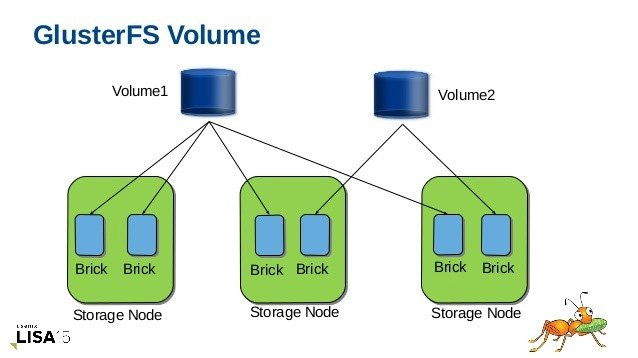
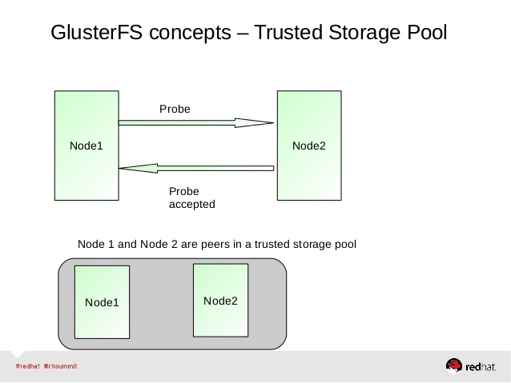
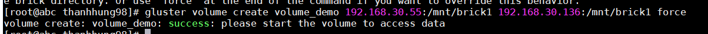
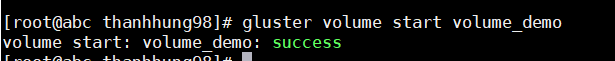
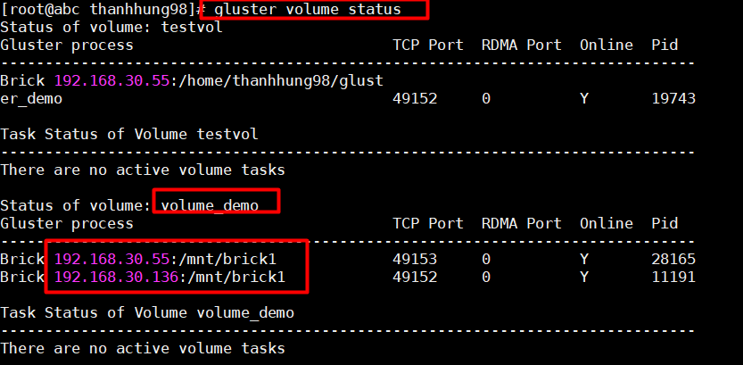
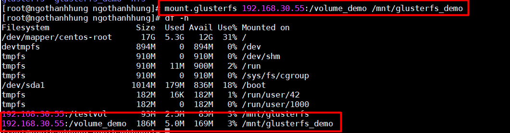

# GLUSTERFS    
## 1. Giới thiệu :  

- Khi các hệ thống lưu trữ ngày càng trở nên rộng lớn, thách thực được đặt ra là làm sao để nó vận hành được tối ưu và dễ dàng mở rộng thêm hơn nữa. Khi server storage bị đầy ta cần ghép thêm server storage mới này vào hoạt động cùng server storage cũ và chia sẻ tải I/O của nó . Glusterfs thực hiện chính xác việc kết hợp nhiều server storage lại thành một khối storage lớn . Ưu điểm của glusterfs đó là:

    -  Glusterfs là một mã nguồn mở.

    -  Glusterfs dễ dàng triển khai trên các server phần cứng thông dụng.

    - Gluster tuyến tính hóa giữa dung lượng và hiệu suất, có nghĩa là nếu đã mở rộng dung lượng thì hiệu suất cũng sẽ tăng theo.

    - Glusterfs xử lý dễ dàng vài Petabyte, cung cấp truy nhập cho hàng ngàn server một lúc.  
## 2. Một vài khái niệm trong Glusterfs:  
- Trusted Storage Pool

    -  Trong một hệ thống GlusterFS, những server dùng để lưu trữ được gọi là những node, và những node này kết hợp lại với nhau thành một không gian lưu trữ lớn được gọi là Pool. Dưới đây là mô hình kết nối giữa 2 node thành một Trusted Storage Pool. 

  

- Brick

   - Từ những phần vùng lưu trữ mới (những phân vùng chưa dùng đến) trên mỗi node, chúng ta có thể tạo ra những brick.
    Brick được định nghĩa bởi 1 server (name or IP) và 1 đường dẫn. Vd: 10.10.10.20:/mnt/brick (đã mount 1 partition (/dev/sdb1) vào /mnt)
    - Mỗi brick có dung lượng bị giới hạn bởi filesystem....
    - Trong mô hình lý tưởng, mỗi brick thuộc cluster có dung lượng bằng nhau.

- Volume :  
Tập hợp các brick trên node cùng pool , kết hợp với nhau thành các volume để người dùng có thể mount và sử dụng .  


## 3. Cấu hình   
- Mô hình :   


##  Cài đặt 
## Server 
### **Cài đặt ổ cứng**
- Để chạy glusterfs ta add 2 ổ cứng mới trên 2 server , cấu hình và mount vào đường dẫn khác đương dẫn root :  
   - Tạo parition :  
```
fdisk /dev/sdb
```  
  - Format partition :  
```
mkfs.ext4 /dev/sdb1
```  
  - Mount partition vào đường dẫn tại mnt (tạo thư mục mới nếu chưa có )
```
mkdir -p /mnt/brick1
mount /dev/sdb1 /mnt/brick1
```  
 - Có thể sửa file /etc/fstab để khi reset server ta không phải mount lại thư mục:  
```
echo "/dev/sdb1 /mnt/brick1 ext4 defaults 0 0" >> /etc/fstab
```
### **Cài đặt glusterfs trên server**
- Install repo chứa GlusterFS cho cả **2 server** 
```
yum -y install centos-release-gluster
```  
-  Sau đó cài Glusterfs cho server 
```
yum -y install glusterfs-server
```
- Khơi động dịch vụ :  

```
systemctl enable glusterd.service
systemctl start glusterd.service
```    
- Từ server 192.168.30.55 add node (server 192.168.30.136) vào pool bằng lệnh :  
```
glusterfs peer probe 192.168.30.136
```


  
- Ta có thể kiểm tra bằng lệnh :  
```
gluster peer status
```


### **Tạo volume**  
- Tạo volume để client có thể mount đến bằng lệnh :  
```
gluster volume create volume_demo 192.168.30.55:/mnt/brick1 192.168.30.136:/mnt/brick1 force
```  
  

- Sau khi tạo thành công cần start volume lên :  
```
gluster volume start volume_demo
```    
    

- Kiểm tra bằng lệnh :  
```
gluster volume status 
```
    
  
  ## Client  
- Cài đặt glusterfs cho phía client :  
```
yum -y install glusterfs-client  
```
- Tạo thư mục để mount :  
``` 
  mkdir /mnt/glusterfs_demo  
```   
- Mount volume được tạo từ server :  
```
mount.glusterfs 192.168.30.55:/volume_demo /mnt/glusterfs_demo
```
    
- Sau khi mount xong ta kiểm tra thấy volume của server tạo ra được mount vào , với dung lượng bằng tổng dung lượng của 192.168.30.55:/mnt/brick1 và 192.168.30.136:/mnt/brick1  
