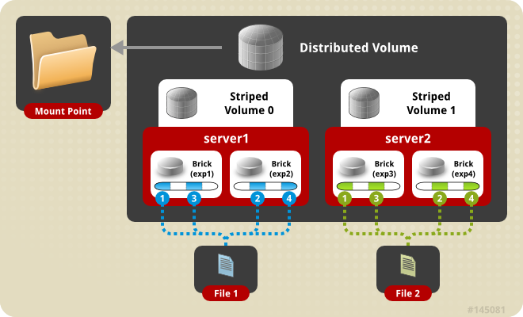

# CÁC LOẠI VOLUME CỦA GLUSTERFS  
Tập hợp các bricks hình thành nên volume . Gluster file system hỗ trợ các loại volume khác nhau dựa theo nhu cầu . Có loại tốt cho việc nâng cấp dung lượng , có loại tốt cho việc cải thiện hiệu năng .  

## 1. Distributed Glusterfs Volume :  
  

- Đây là cấu hình mặc định của volume . Khi tạo volume và không có lệnh để đặt kiểu thì sẽ mặc định là distributed volume . Với kiểu lưu trữ này dữ liệu được phân tán tới các brick trong volume .
- Metadata được lưu trữ trực tiếp trên từng bricks nên không cần thiết phải có metadata server , tiết kiệm được tài nguyên .  
- Ưu điểm :  
    - Mở rộng dung lượng dễ dàng 
- Nhược điểm ;  
    - Nếu 1 trong các brick bị lỗi , dữ liệu trên brick đó sẽ bị mất .  

## 2. Replicated Glusterfs Volume

 - Kiểu volume này khắc phục nhược điểm cảu distributed volume . Một bản copy của data sẽ được duy trì trên các brick. Số bản copy có thể được cấu hình bởi người dùng khi tạo volume . Do đó cần ít nhất 2 ổ cứng để chạy kiểu volume này .
 - Ưu điểm : Phù hợp với hệ yêu cầu tính sẵn sàng cao và tính dự phòng 
 - Nhược điểm : Tốn tài nguyên hệ thống 

 ## ​3. Distributed Replicated Glusterfs Volume

  

Kiểu lưu này phân tán dữ liệu và tạo copy cho dữ liệu đó . Là sự kết hợp của 2 kiểu volume trên . Cần tối thiểu 3 node để chạy .Nếu bị lỗi đồng thời 2 server 1,2 hoặc 3,4 thì hệ thống sẽ k hoạt động được 
- Ưu điểm : Khi hệ thống yêu cầu tính sẵn sàng và việc nâng cấp hệ thống cần được đặt lên trên.
- Nhược điểm : Tốn quá nhiều tài nguyên .

## ​4. Striped Glusterfs Volume

Khi lưu trữ một file quá lướn lên 1 brick sẽ khiến brick đó phải chịu tải quá nhiều và sẽ gây giảm hiệu suất truy cập . Sử dụng striped volume sẽ chia nhỏ file lớn thành các mảnh nhỏ hơn và lưu trữ tại các brick .
- Ưu điểm : Tăng hiệu suất sử dụng , phù hợp môi trường cần truy suất file dung lượng lớn.
- Nhược điểm : không đảm bảo an toàn cho dữ liệu .

## ​5. Distributed Striped Glusterfs Volume
  

Kết hợp giữa distributed và striped , dữ liệu được lưu tới nhiều brick hơn nữa.
