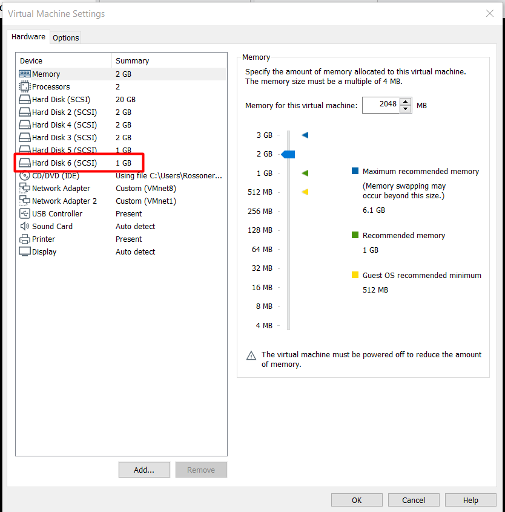
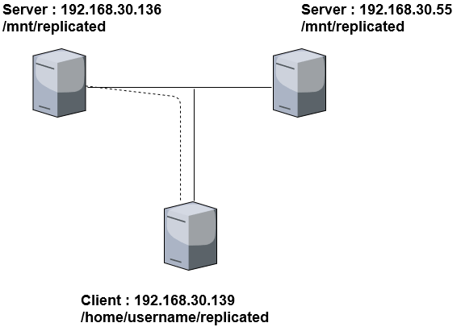
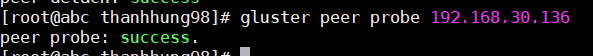
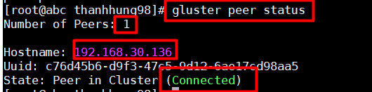
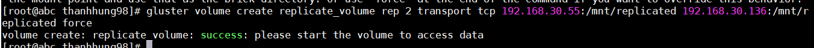
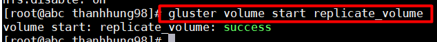
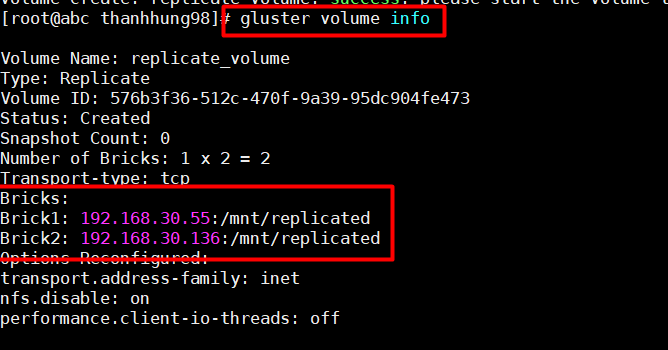

# CÀI ĐẶT STRIP VOLUME - REPLICATED VOLUME 
## 1.Chuẩn bị :  
- 3 máy ảo VMWare cài CentOS7 và có cài glusterfs.  
Tham khảo cài đặt glusterfs: https://github.com/nthung98/Tong_Hop_Note/blob/master/Linux/Glusterfs/docs/1.Glusterfs.md  
- Tại 2 máy Server 192.168.30.55 và 192.168.30.136 thêm ổ cứng 1GB :   

  

## 2. Cài đặt replicated volume :  
- Mô hình :  
  - Client chỉ cần mount đến 1 brick của 1 trong 2 server , dữ liệu sẽ được share trên các brick thuộc cùng volume group được cấu hình của server .  

  

- Cài đặt :  
## Tại server 192.168.30.55 :  

- Tạo parition :  
```
fdisk /dev/sdb
```  
- Format partition :  
```
mkfs.ext4 /dev/sdb1
```  
  - Mount partition vào đường dẫn tại mnt (tạo thư mục mới nếu chưa có )
```
mkdir -p /mnt/brick1
mount /dev/sdb1 /mnt/brick1
```  
 - Có thể sửa file /etc/fstab để khi reset server ta không phải mount lại thư mục:  
```
echo "/dev/sdb1 /mnt/brick1 ext4 defaults 0 0" >> /etc/fstab
```
- Từ server 192.168.30.55 add node (server 192.168.30.136) vào pool bằng lệnh :  
```
glusterfs peer probe 192.168.30.136
```



  
- Ta có thể kiểm tra bằng lệnh :  
```
gluster peer status
```


> **Lặp lại các bước ở trên với server 192.168.30.136 . Trừ bước thiết lập peer .**  

### **Tạo volume : ( Chỉ cần thao tác tại một máy server)**  
- Từ server 192.168.30.55 , tạo volume để client có thể mount đến bằng lệnh :  
```
gluster volume create replicate_volume rep 2 192.168.30.55:/mnt/replicated 192.168.30.136:/mnt/replicated force
```  
  

- Sau khi tạo thành công cần start volume lên :  
```
gluster volume start volume_demo
```    
  
 

- Kiểm tra bằng lệnh :  
```
gluster volume info
```
  
   

## Cấu hình phía client : 
- Bên client mount lại và sử dụng :  
     Mount volume được tạo từ server :  
```
mount.glusterfs 192.168.30.55:/replicate_volume /mnt/replicated
```  
  

