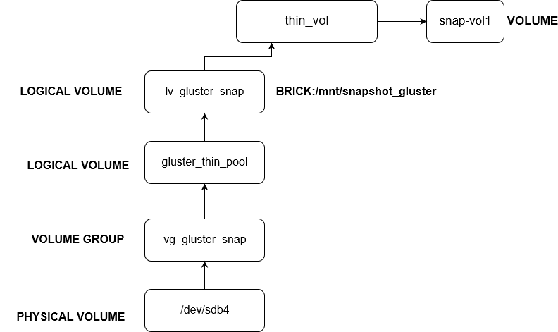
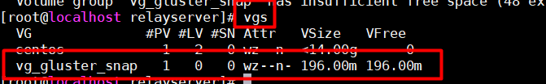
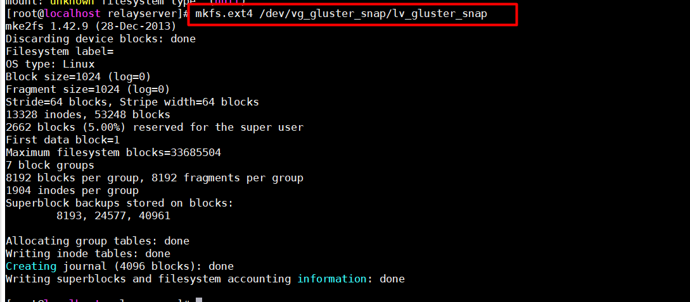
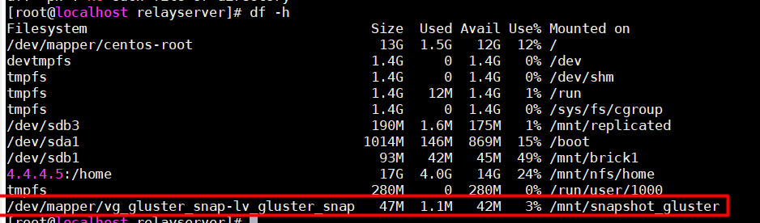
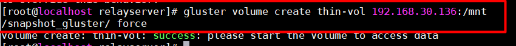
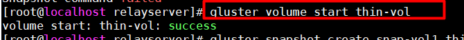
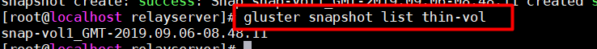

# Snapshot
## 1. Snapshot CỦA GLUSTERFS :  
Glusterfs volume snapshot dựa trêntính năng thinly provisioned LVM snapshot . Để tạo được snapshot của Glusterfs volume cần có những điều kiện sau :  
- Mỗi brick độc lập trên một logical thinly provisioned lvm riêng.
- thinly provisioned LV này chỉ nên được sử dụng cho 1 bricks
- Brick không được cài trên lvm thick.
- Gluster version từ 3.6 trở lên 


## 2. Tính năng snapshot :

- Crash Consistency

Khi snapshot được sử dụng , nó đảm bảo cho việc dữ liệu được bảo toàn , nguyên vẹn .

- Online Snapshot
Hỗ trợ online snapshot qua internet .  

- Quorum Based  
Quorum bảo vệ volume khi các brick bị down.


Barrier
- Snapshot không được tạo trong thời gian nhất định ( default là 2 phút ) sẽ bị gắn unbarried . Nếu unbarried được gán trước khi snapshot hoàn thành thì snapshot sẽ lỗi . Điều này đảm bảo cho dữ liệu snapshot .

## 3. Cài đặt : 
### Yêu cầu  : 
    - Máy ảo Centos 7
    - Thêm ổ cứng nếu cần để cấu hình thin provisioning 


### Cấu hình  :  
- Cấu hình lvm thin provisioning , ở đây ta tạo từ /dev/sdb4
- Tạo volume group :  
```
vgcreate /dev/vg_gluster_snap /dev/sdb4
```  


- Kiểm tra volume group :   

```
vgs 
```

  

- Tạo thin pool :  

```
lvcreate -L 100M --thinpool gluster thin_pool vg_gluster_snap 
```     
  

- Tạo logical volume từ thin pool :    

```
lvcreate -V 50M --thin -n lv_gluster_snap vg_gluster_snap/gluster_thin_pool
```  
  

- Cấu hình filesystem cho logical volume mới tạo :  

```
mkfs.ext4 /dev/vg_gluster_snap/lv_gluster_snap
```


- Mount lại để sử dụng như brick trong gluster :     

```
mount /dev/vg_gluster_snap_lv_gluster_snap /mnt/snapshot_gluster
```  
Kiểm tra 
```
df -h
```  

 

- Tạo volume của gluster để người dùng có thể mount lại  :    

```
gluster volume create thin-vol 192.168.30.136:/mnt/snapshot_gluster/ force
```  

> Trong đó : 
>- 192.168.30.136 : IP của máy chứa brick 

 

- Start volume để có thể sử dụng :    

```
gluster volume start thin-vol
```  

  

- Tạo snapshot cho volume mới tạo :    

```
gluster snapshot create snap-vol1 thin-vol
```   


- Kiểm tra snapshot của volume :  

```
gluster snapshot list thin-vol
```
