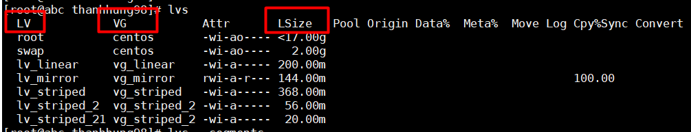
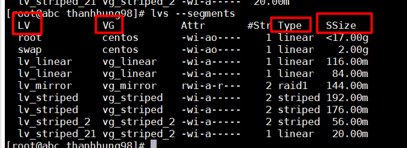
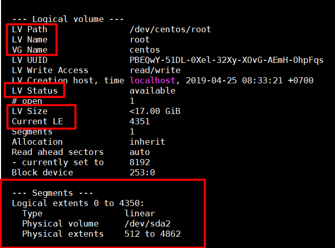
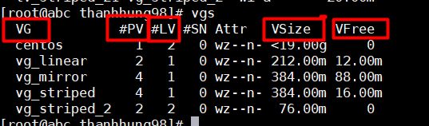
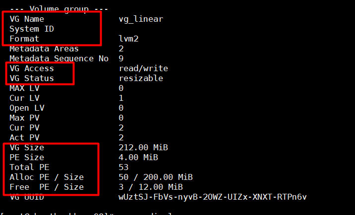
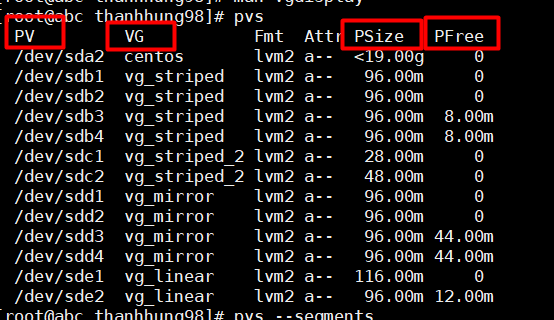
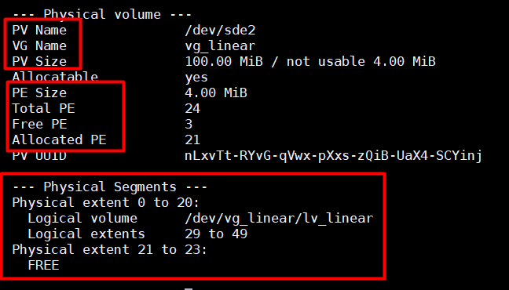
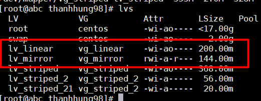

# NOTE   

### Các lệnh thường sử dụng trong LVM  

- Tạo Partition :  
```
fdisk /dev/sda
```  
- Tạo Physical Volume :  
```
pvcreate /dev/sda1 
```  
- Tạo Volume Group:  
```
vgcreate vg-demo1 /dev/sda1 
```
- Tạo Logical Volume :  

 ```
 lvcreate -L 1G -n lv-demo1 vg-demo1
 ```  
 Trong đó :  
   >-L: Chỉ ra dung lượng của logical volume  
   -n: Chỉ ra tên của logical volume  

### Các lệnh kiểm tra :  
- Kiểm tra các Hard Drives , Partition trong máy bằng lệnh :    
```
lsblk
```  
- Kiểm tra Logical Volume :  
```
lvs
``` 
>LV : Tên Logical VOlume  
VG : Tên Volume Group mà Logical Volume thuộc về .  
LSize : Dung lượng Logical Volume  
   
  
  
  
```
lvs --segments  
```  
  >Tương tự lệnh lvs nhưng có hiển thị thêm Type để xem Logical Volume là linear , striped , ...  

  


```
lvdisplay -m
```  
>LV Path : Đường dẫn của Logical Volume
LV Name : Tên Logical Volume  
VG Name : Tên Volume Group  
LV Status : trạng thái  
LV Size : Dung lượng Logical Volume  

>Trong phần Segments hiển thị chi tiết hơn về các Logical Extend , các LE thì thuộc Physical Volume nào và trong khoaangr Physical Extents bao nhiêu .    
Type : Kiểu ghi của Logical Volume (Linear , Striped ...)  


  


- Kiểm tra Volume Group :  

```
vgs
```   
>VG :Tên Volume group  
#PV : số lượng PV tạo nên Volume group  
#LV : số LV tạo ra từ Volume group  
VSize: Tổng dung lượng của Volume group  
VFree : Dung lượng Free của Volume Group  

  

```
vgdisplay 
```  
>VG Name : tên Volume Group  
VG Access : Quyền read , write của Volume Group  
VG Status : Extend , reduce Volume Group được hkoong   
VG Size : Tổng dung lượng Volume Group  
PE Size : Dung lượng của 1 Physical Extend  
Total PE : Tổng các PE tạo nên Volume Group ( PESize * TotalPE = VGSize)  
Alloc PE/Size : Dung lượng đã được dùng để tạo Logical Volume hiển thị dưới dạng PE/Size  
Free PE/Size : Dung lượng còn trống trong Volume Group hiển thị dưới dạng PE/Size  

  

- Kiểm tra Physical Volume :  
```
pvs
```  
>PV : Tên Physical Volume  
VG : Tên Volume Group mà Physical Volume thuộc về  
PSize: Dung lượng Physical Volume  
PFree : Dung lượng free của Physical Volume  


  

```
pvdisplay -m
```  
>PV Name : tên Physical Volume  
VG Name : Tên Volume Group mà Physical Volume tạo nên.  
PV Size : Tổng dung lượng của Physical Volume  
PE Size : kích thước của 1 PE  
Total Pe : Tổng PE của Physical Volume  (PESize * Total PE = PVSize)  
Free PE : Số PE free  
Allocated PE : Số PE đã được sử dụng để tạo nên Volume Group  

>Trong Physical Segments hiển thị rõ hơn về các PE .  
Số lượng các PE thuộc Các logical Volume nào và Map với các LE nào .  

  


## Tốc độ ghi giữa LV Linear và LV Striped  
Để so sánh tốc độ ghi , ta ghi 100MB vào 2 Logical Volume Striped và Linear :  
  

dd if=/dev/vg_linear/lv_linear of=/home/thanhhung98/lvm_linear_test bs=1G count=1 oflag=direct  

 dd if=/dev/vg_striped/lv_striped of=/home/thanhhung98/lvm_striped_test bs=1G count=1 oflag=direct
