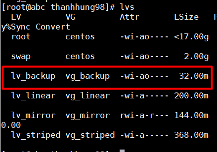
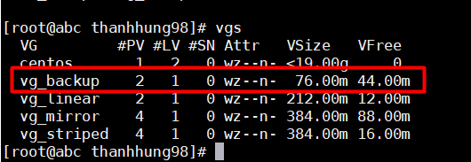
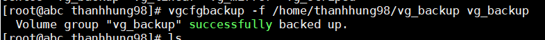
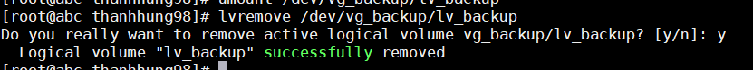
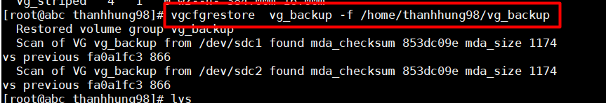
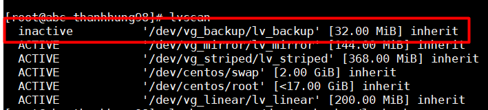
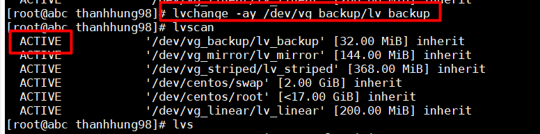
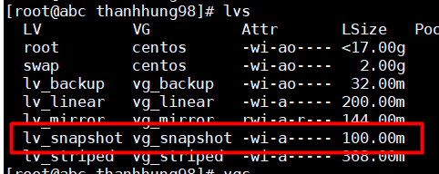
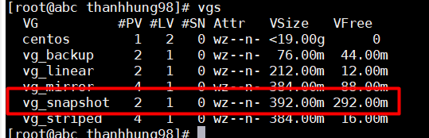
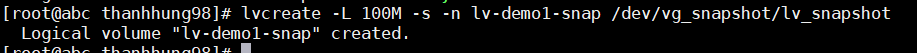

# TÌM HIỂU VỀ LVM BACKUP VÀ SNAPSHOT  
## 1. LVM Backup :  
### 1.1. vgcfgbackup :  

Khi tạo , xóa , thêm logical volume, ... các thao tác trên sẽ được cập nhật ở volume group với config file tại /etc/lvm/.Khi ổ đĩa lỗi ta có thể restore cấu hình LVM bằng một file cấu hình backup. Lệnh `vgcfgbackup` sẽ lưu các cấu hình của volume group và lưu vào file tại /etc/lvm/backup/vg_name . Mặc định vgcfgbackup tự động chạy.  
. Câu lệnh :   
```
vgcfgbackup [-f path_newfilename ] vg_name  
```  
>Trong đó :  
>- vg_name : Tên của volume group  
>- -f : chỉ định nơi lưu trữ file backup , nếu không có thì mặc định lưu tại /etc/lvm/backup/    


### 1.2. vgcfgrestore :  
  Lệnh `vgcfgrestore` sẽ restore các cấu hình volume group từ các physical volume . File lưu trữ tại /etcc/lvm/archive. Câu lệnh :    
```
vgcfgrestore [-f|--file <filename>] [-v] vg_name  
```
   >-  vg_name : Tên volume group .
   >  - -f : Đường dẫn lưu file backup .  
   > - -v : Hiển thị chi tiết khi chạy lệnh .

### 1.3.Cấu hình :  
   - Chuẩn bị :  

     


  
Tạo logical volume lv_backup từ volume group vg_backup.  

### Backup :  
- Dùng lệnh :  
```
vgcfgbackup -f path_name /dev/vg_name
```  
  
### Restore :  
  
- Để restore , trước tiên ta remove logical volume vừa tạo    

  

- Sau đó restore lại bằng lệnh :   
```
vgcfgrestore vg_name -f path_name
```  

  

- Dùng lệnh dưới để kiểm tra :  
```
lvscan
```  
  

- Ta thấy logical volume vừa bị xóa đi đã được restore , tuy nhiên ở trạng thái inactive. Để active lại logical volume sử dụng lệnh sau :    

```
lvchange -a y /dev/vg_backup/lv_backup
```  
  

- Kiểm tra lại ta thấy trạng thái là active .  

**Chú ý**
>Ta có thể restore bằng các file trong /etc/lvm/backup hoặc /etc/lvm/archive   

## 2.LVM Snapshot  
### 2.1. Snapshot  
LVM Snapshot tạo một bản copy của các lvm volume . Chỉ lưu các thay đổi của LVM trước khi đã tạo snapshot volume .  VÍ dụ nếu volume gốc có thay đổi 1GB dữ liệu , thì 1GB dữ liệu đó cũng được thay đổi tại snapshot volume .LVM snapshot cho phép tạo virtual image của thiết bị .  

### 2.2 Cấu hình :  
-  Chuẩn bị :   

  


  

Tạo logical volume lv_snapshot từ volume group vg_snapshot.  


- Tạo snapshot volume  
```
lvcreate -L 100M -s -n lv-demo1-snap /dev/vg_demo1/lv_demo1  
```  
>Trong đó :  
>- -L : Dung lượng muốn tạo ra cho logical volume snapshot  
>- -s : Tạo snapshot
>- -n : tên của logical volume snapshot  
>- /dev/vg_demo1/lv_demo1 : Đường dẫn của logical volume gốc mà ta muốn snapshot   

   
 
- 
