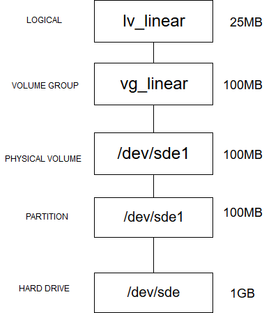
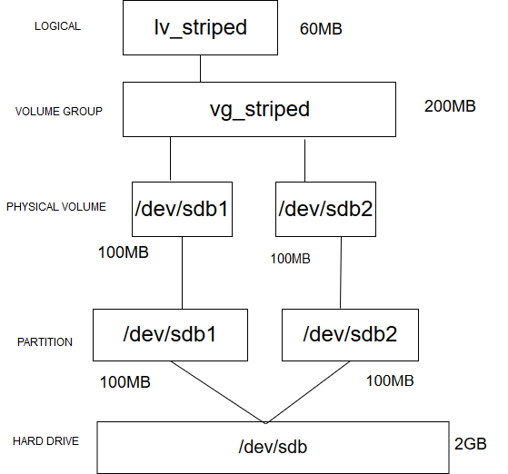
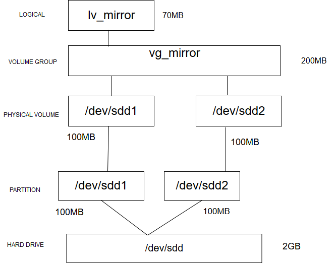

# LOGICAL VOLUME  

## 1. Cài đặt Linear :
Từ 1 ổ cứng 1Gb , ta tạo partition 100Mb và cài đặt logical volume ( /dev/sde1)
  

Cách ghi của ổ Linear:  


  - Tạo các physical volume :  
  ```
  pvcreate /dev/sde1
  ```  
  - Tạo volume group :  
  ```
  vgcreate vg_linear /dev/sde1
  ```
- Tạo logical volume :  
```
lvcreate -L 25M -n lv_linear vg_linear

```  
  sau khi tạo logical volume ta mount lại để sử dụng :  
  ```
  mount /dev/vg_linear/lv_linear /home/user/Ten_directory  
  ```  
Ta kiểm tra lại thấy logical volume đã được mount , với dung lượng 25MB.
  

- Giả sử nếu logical volume đã đầy , ta có thể thêm dung lượng vào như sau :  
Trước tiên ta phải kiểm tra volume group xem có còn dung lượng free không bằng lệnh : 
```
vgs
```  
   
Ta thấy sau khi sử dung 25MB cho logical tại volume group còn free 84MB  
Để tăng kích thước Logical Volume ta sử dụng câu lệnh sau:

```
lvextend -L +20M /dev/vg_linear/lv_linear  
```
Trong đó -L là dung lượng muốn thêm vào  

   

Ta thấy logical volume cũ đã tăng thêm 20MB. 

   


## 2. Cài đặt Striped:  
Từ 1 ổ 1Gb ta chia thành 2 physical volume , mỗi physical volume 100MB  
   

Cách ghi ổ striped : 

   

- Tạo physical volume :  

```
 pvcreate /dev/sdb1 /dev/sdb2
```  

- Tạo volume group:  
```
vgcreate vg_striped /dev/sdb1 /dev/sdb2

```  
- Tạo logical volume:
```
lvcreate -L 60M -n lv_striped -i2 vg_strip
```

Chú ý:  
 -L dung lượng tạo logical volume , ở đây là 60MB  
 -i2 số physical volume ta ghi vào khi sử dụng striped,  ở đây khi dữ liệu được ghi vào sẽ chia vào 2 physical volume  


Ta có thể kiểm tra bằng các lệnh :  

```
pvdisplay -m

lvs --segments

```
     

  
Logical volume có type là striped .  
 

**Lưu ý:  
Khi tạo logical volume striped , dung lượng của Logical volume được tạo ra sẽ được các physical volume chia đều để lưu trữ .Ví dụ nếu có 2 physical volume tạo nên một volume group , ta tạo logical volume với 100MB thì mỗi physical volume sẽ chứa 50MB.**   

  

Ta thấy hai physical volume /dev/sdb1 và dev/sdb2 đã dành ra một khoảng là 30 MB để lưu trữ cho logical volume với dung lượng là 60MB.    

- Giả sử ta đã sử dụng hết dung lượng của logical volume và extend hết từ volume group.Nếu muốn thêm dung lượng volume group ta sẽ add thêm 2 physical volume vào volume group này .  
```
vgextend vg_striped /dev/sdb3 /dev/sdb4
```  
Với sdb3 và sdb4 là hai physical volume , mỗi physical volume có dung lượng 100MB.Sau đó ta extend logical volume   

```
lvextend /dev/vg_striped/lv_striped -L 100M
```
  

Ta thấy logical volume đã tăng thêm dung lượng , từ 60MB lên 100MB

  

## 3. Cài đặt Mirror: 
Từ ổ cứng 2Gb ta tạo ra 2 physical volume 100MB  

   
  
 ```

 ```  
 Trong đó :  
 -L dung lượng Logical volume  
 -m1 số mirror lưu ,ở đây ta tạo 2 mirror lưu vào 2 ổ 
   

 **Lưu ý :   
  Điều kiện chạy được mirror volume là Logical Volume tạo ra không được vượt quá dung lượng physical Volume bé nhất**  

   

 Ta thấy với dung lượng 1GB ở ổ sdb1 và dbc1 (255 PE), cùng chung volume group 1 , cả 2 physical volume trên dành ra một dung lượng là 500MB mỗi PV (126 PE) để lưu trữ cho logical volume mirror .  


 Kiểm tra bằng các lệnh tương tự như của striped:  
     
   Ta thấy type là Raid1 , tức là logical volume mirror đã được cài đặt thành công.

