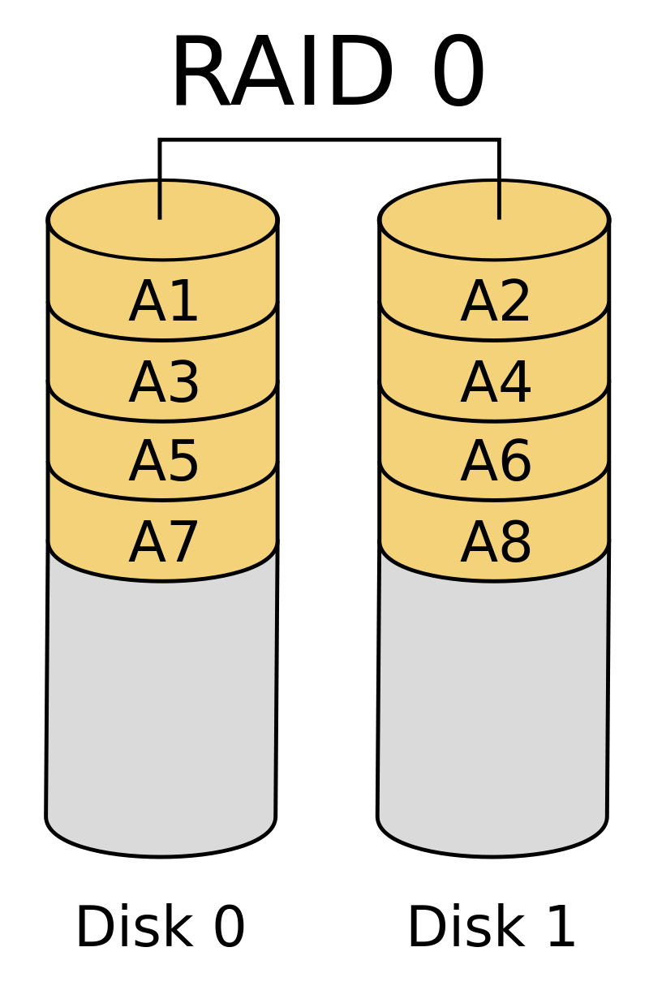
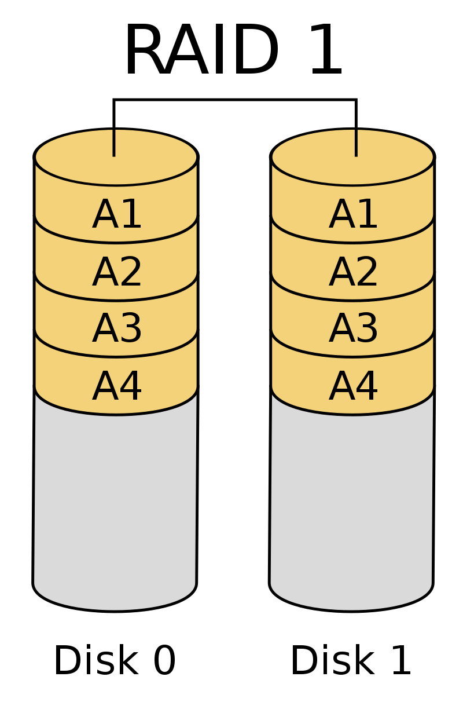
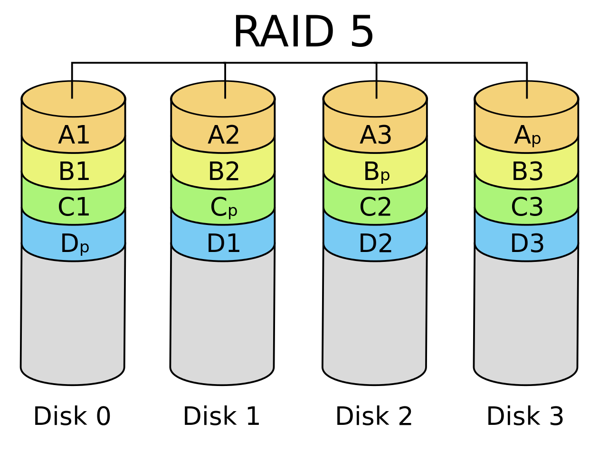
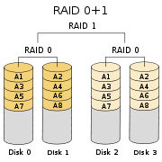
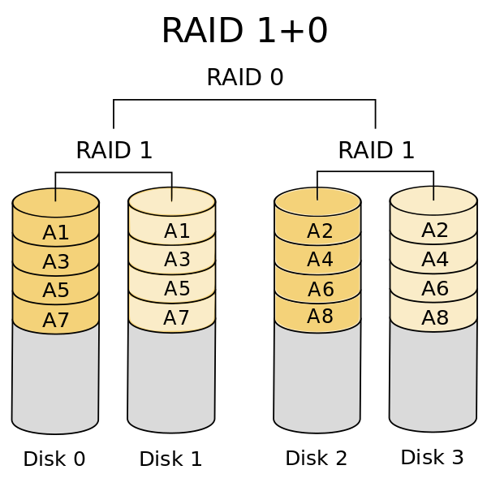

# TÌM HIỀU VỀ RAID 

## 1. Giới thiệu :  
RAID là viết tắt của Redundant Array of Inexpensive Disks (Hệ thống đĩa dự phòng). Đây là hệ thống hoạt động bằng cách kết nối một dãy các ổ cứng có chi phí thấp lại với nhau để hình thành một thiết bị nhớ đơn có dung lượng lớn hỗ trợ hiệu quả cao và đáng tin cậy hơn so với các giải pháp trước đây. RAID được sử dụng và triển khai thành phương pháp lưu trữ trong doanh nghiệp và các máy chủ, nhưng trong 5 năm sau đó RAID đã trở nên phổ biến đối với mọi người dùng. 

### Ưu điểm :  
- Dự phòng  
- Hiệu quả cao  
- Giá thành thấp  

## 2. Các loại RAID :  
- Theo RAB thì RAID được chia thành 7 cấp độ (level), mỗi cấp độ có các tính năng riêng, hầu hết chúng được xây dựng từ hai cấp độ cơ bản là RAID 0 và RAID 1. 
### 2.1. RAID 0 :   
  
- RAID 0 thực ra không phải là cấp độ RAID hợp lệ. Cấp độ 0 được đưa ra không thể cung cấp cấp độ dự phòng nào cho các dữ liệu được lưu trữ. Do vậy nếu một ổ cứng bị lỗi thì sẽ gây nguy hiểm cho dữ liệu.

- RAID 0 sử dụng một kĩ thuật gọi là “striping”. “Striping” phân chia khối dữ liệu đơn trải chúng qua các ổ cứng. Tác dụng của striping là làm tăng hiệu quả thực thi. Có thể ghi được hai khối dữ liệu cùng lúc tới hai ổ cứng, hơn hẳn so với một ổ cứng như trước đây.    
- Ưu điểm :
   - Tăng hiệu quả lưu trữ.
   - Không làm mất dung lượng dữ liệu.

- Nhược điểm:

    - Tính an toàn dữ liệu thấp, rủi ro cao. Nếu 1 trong bất kỳ ổ đĩa đơn vật lý bị hư thì dữ liệu còn lại ở các ỗ đĩa vật lý khác cũng không còn sử dụng được nữa. Xác suất mất dữ liệu sẽ tăng n lần so với dùng ổ đĩa đơn.

### 2.2. RAID 1 :  
  

- RAID 1 mới là phiên bản thực sự đầu tiên. RAID cung cấp phương pháp dự phòng dữ liệu đơn giản bằng kĩ thuật “mirroring” (nhân bản dữ liệu). Kĩ thuật này cần 2 ổ cứng riêng biệt có cùng dung lượng. Một ổ sẽ là ổ hoạt động, ổ còn lại là ổ dự phòng. Khi dữ liệu được ghi vào ổ hoạt động thì đồng thời nó cũng được ghi vào ổ dự phòng.
 
- RAID 1 cung cấp một phiên bản dự phòng dữ liệu đầy đủ cho hệ thống. Nếu một ổ gặp sự cố, ổ còn lại vẫn còn hoạt động. Hạn chế của kĩ thuật này là dung lượng RAID chỉ bằng dung lượng nhỏ nhất của hai ổ cứng nếu như dung lượng lưu trữ trên hai ổ được sử dụng độc lập.  
- Ưu điểm :
  -   Cung cấp dự phòng dữ liệu toàn diện.
   
- Nhược điểm:
    - Tốc độ ghi dữ liệu thấp .
    - Không tăng hiệu suất thực thi.
### 2.3. RAID 5 : 
  

RAID 5 mạnh nhất cho hệ thống các máy để bàn. Đặc trưng của chúng là cần phải có một bộ điều khiển phần cứng quản lý các dãy ổ cứng nhưng một số hệ điều hành máy tính có thể thực hiện điều này qua các phần mềm. Phương pháp này sử dụng phân chia “parity” (chẵn lẻ) để duy trì dự phòng dữ liệu. Cần ít nhất 3 ổ cứng có năng xuất cao như nhau để áp dụng RAID 5.

Giả sử dữ liệu A được phân tách thành 3 phần A1, A2, A3, khi đó dữ liệu được chia thành 3 phần chứa trên các ổ đĩa cứng 0, 1, 2 (giống như RAID 0). Phần ổ đĩa cứng thứ 3 chứa Parity (Ap) của A1 A2 A3 để khôi phục dữ liệu có thể sẽ mất ở ổ đĩa cứng 0, 1, 2. Dữ liệu B được chia thành B1 B2 B3 và Parity của nó là Bp, theo thứ tự B1 B2 B3 được lưu trữ tại ổ 0 1 3, và Bp được lưu trữ tại ổ 2. Các Parity được lưu trữ tuần tự trên các ổ đĩa cứng. RAID 5 cho phép tối đa có 1 ổ cứng bị chết tại một thời điểm, nếu có nhiều hơn 1 ổ cứng bị chết tại một thời điểm thì toàn bộ dữ liệu coi như mất hết. RAID 5 cũng yêu cầu các ổ cứng tham gia RAID phải có dung lượng bằng nhau.   
- Ưu điểm :

    - Tăng dung lượng lưu trữ
    - Dữ liệu được dự phòng toàn bộ
    - Khả năng hoán đổi nhanh 24x7

- Nhược điểm:

    - Giá thành cao
    - Hiệu quả thực thi giảm trong quá trình phục hồi

  
### 2.3. RAID 0+1 :
  

- Đây là sự kết hợp RAID mà một số hãng sản xuất đã thực hiện để gộp các lợi ích của hai phiên bản lại với nhau. Sự kết hợp này chỉ áp dụng với các hệ thống có ít nhất 4 ổ cứng. Các kĩ thuật “mirroring” và “striping” kết hợp với nhau tạo ra hiệu quả dự phòng. Thiết lập đầu tiên của các ổ được kích hoạt và các dữ liệu sẽ được phân chia qua đó, thiết lập thứ hai sẽ phản chiếu những dữ liệu này sang ổ thứ hai.  
- Trong trường hợp này, các khối dữ liệu sẽ được phân chia qua các ổ và được phản chiếu giữa hai thiết lập. Hiệu quả thực thi của RAID 0 được tăng lên vì ổ cứng chỉ phải mất một nửa thời gian thực hiện so với một ổ riêng lẻ mà vẫn đảm bảo sự dự phòng. Hạn chế chính của phương pháp này là giá thành bởi nó cần phải có ít nhất 4 ổ cứng.

- Ưu điểm :

    - Tăng hiệu quả thực thi.
    - Dữ liệu được dự phòng toàn bộ.

- Nhược điểm:

    - Yêu cầu số lượng ổ cứng lớn.
    - Khả năng truy xuất dữ liệu giảm một nửa.

### 2.4.RAID 10 hay 1+0 :  

  

- RAID 10 gần giống như RAID 0+1. Thay vì phân chia dữ liệu giữa các thiết lập ổ đĩa rồi phản chiếu chúng thì hai ổ cứng đầu tiên sẽ được phản chiếu với nhau. Đây là thiết lập RAID lồng. Hai cặp ổ 1 và 2, 3 và 4 sẽ phản chiếu lẫn nhau. Sau đó chúng sẽ được thiết lập thành các dãy phân chia dữ liệu.

- Cũng thiết lập giống như RAID 0+1, RAID 10 cần tối thiểu là 4 ổ cứng để thực hiện chức năng của mình. Tuy nhiên dữ liệu được bảo vệ bằng RAID 10 an toàn hơn RAID 0+1 rất nhiều.

- Ưu điểm :

  -  Tăng hiệu quả thực thi.
   - Dữ liệu được dự phòng toàn bộ.

- Nhược điểm:

   - Yêu cầu số lượng ổ cứng lớn.
    - Khả năng truy xuất dữ liệu giảm một nửa.

