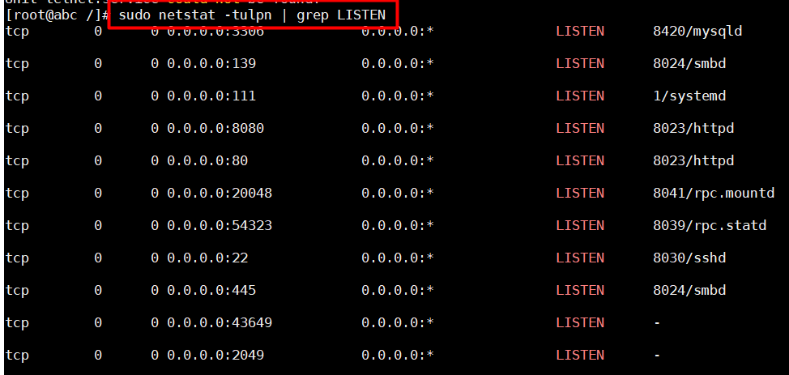
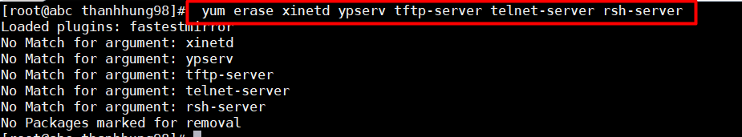
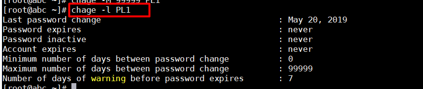
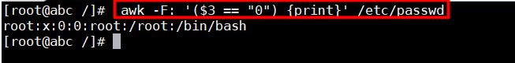

# 40 Linux Server Hardening Security Tips   

## 1. Mã hóa dữ liệu :  
## 2. Tránh dùng FTP , Telnet , Rlogin/Rsh :
Trong các hệ thống mạng , username , password , các lệnh FTP , telnet , rsh có thể bị capture bởi bất kì ai trong network sử dụng packet sniffer . Cách giải quyết vấn đề này là sử dụng OpenSSH , SFTP , FTPS (FTP over SSL) , đó là các phần mềm sử dụng thêm mã hóa SSL hoặc TLS .
 
Để đảm bảo hệ thống an toàn , ta kiểm tra các port đang mở trên hệ thống :
```
sudo netstat -tulpm | grep LISTEN  
```  

  

 Sau đó sử dụng lệnh sau để xóa các NIS(Network Information Service) ,rsh và các service quá hạn : 
```
sudo yum erase xinetd ypserv tftp-server telnet-server rsh-server
```  

3. Tối giản các phần mềm trong hệ thống :  
Hệ thống trong máy không cần sử dụng hết tất  cả các web service đã được cài đặt . Hạn chế sử dụng các phần mềm không cần thiết cũng là một cách để tránh các lỗ hổng về bảo mật . Để tránh vấn đề trên , sử dụng RPM package manager hoặc yum để kiểm tra ,review lại tất cả các phần mềm , các packages đã cài đặt . Sau đó xóa đi ác packages không dùng đến .    

```
yum list installed
yum list package_Name
yum remove package_Name
```  

>Lưu ý :  
>yum list installed : liệt kê ra các gói phần mềm đã cài đặt .  
>yum list package_Name : liệt kê các gói phần mềm cài đặt với tên xác định  
>yum remove package_Name : Xóa gói phần mềm đã cài đặt .  

## 4. Một dịch vụ mạng trên một hệ thống hoặc VM : 
## 5. Update linux kernel và phần mềm :  
Cập nhật thường xuyên các bản vá là rất trọng trong việc quản trị hệ thống Linux server . Các bản cập nhật về bảo mật nên được review và cài đặt càng sớm càng tốt . Khi đó ta sử dụng rpm hoặc yum để cài đặt .  
```
yum update
```  

>Lưu ý :  
>update : hệ thống cập nhật các bản mới nhất trong kho của centos .
>upgrade : cài đặt các bản cập nhất mới nhất có trong kho.
## 6. Sử dụng các security extensions:  
## 7.SELinux  
## 8. Quản lý account user và cài đặt mật khẩu mạnh   
Ví dụ cho mật khẩu mạnh là có ít nhất 8 kí tự , kết hợp giữa chữ , số , kí tự đặc biệt , viết hoa , ... . 
## 9. Đặt giới hạn thời gian cho password của user :  
- Lệnh `chage` cho phép đặt số ngày mà người dùng cần thay đổi password tính từ lần thay đổi gần nhất . Ta cũng có thể cấu hình trực tiếp qua file /etc/login.defs  
- Để disable thời gian cài đặt lại password , dùng lệnh :  
```
chage -M 99999 userName 
```  
- Xem thông tin về password expiration :  
```
chage -l userName
```  
  

- Cấu hình trong file :  
```
{userName}:{password}:{lastpasswdchanged}:{Minimum_days}:{Maximum_days}:{Warn}:{Inactive}:{Expire}:
```  
>Trong đó :  
>Minimum_days : Số ngày ít nhất cần thay đổi password  
>Maximum_days : số ngày lớn nhất .  
>Warn : Số ngày trước khi hết hạn sẽ cảnh báo người .    
>Expire : Thời gian (thường là ngày tháng nhất định , ví dụ Jan 1,1979) mà mật khẩu bị hết hạn.  

## 10.Không dùng lại mật khẩu cũ  
## 11. Lock user sau khi nhập sai password :  
Lệnh `faillog` để hiển thị record hoặc đặt số lượng lần có thể login sai .

>Chú ý : Có thể dùng passwd để lock và unlock mật khẩu của account :  
>- Lock account : passwd -l userName , usermod -L userName 
>- Unlock account : passwd -u userName  , usermod -U userName
>- root vẫn có quyền truy cập vào các account này dù có bị khóa .
## 12. Kiểm tra account không có password :  
dùng lệnh :  
```
awk -F: '($2 == "") {print}' /etc/shadow
```  

## 13. Đảm bảo không có account nào trừ root có UID là 0  
Trừ root với UID 0 được quyền kiểm soát hoàn toàn hệ thống . Kiểm tra bằng lệnh sau :  
```
awk -F: '($3 == "0") {print}' /etc/passwd
```    

  

Thường sẽ chỉ có tài khoản root như hình , nếu có thêm thì cần xóa hoặc sửa lại quyền của account.  

## 14. Không login bằng root :  
Dùng lệnh sudo thay thế .
## 15. Bảo mật vật lý 

## 16. Disable dịch vụ không cần thiết :  
Disable các dịch vụ không cần thiết và các dịch vụ chạy ngầm . Ta cần xóa các dịch vụ đó trong system start-up . Dùng các lệnh sau :  
```
chkconfig --list | grep '3:on'
```  
To disable service, enter:
```
service serviceName stop
chkconfig serviceName off  
```  

## 17. Kiểm tra port 
Lệnh :  

```
netstat -tulpn
ss -tulpn
```  

## 18. Delete X Window Systems (X11)  
Trên các server như mail hay Apache/Nginx web server , X Window là không cần thiết . Ta có thể disable và xoa X Windows đi để tăng cường bảo mật và hiệu năng . Edit /etc/inittab bằng dòng sau để set run level là 3 
```
id:3:initdefault:
```
Sau đó xóa X Windows system bằng lệnh :    

```
yum group remove "X Window System"
```  
Trên CentOS 7/RHEL 7 server dùng các lệnh sau :
```
yum group remove "GNOME Desktop" 
yum group remove "KDE Plasma Workspaces"
yum group remove "Server with GUI"
yum group remove "MATE Desktop"  
```  

## 19. Cấu hình , sử dụng Iptables ,TCPWrappers   
## 20. Cấu hình Linux Kernel /etc/sysctl.conf
File /etc/sysctl.conf dùng để cấu hình các thông số của hệ thống khi chạy . Linux sẽ đọc và áp dụng các setting từ /etc/sysctl.conf khi boot . 
Sample /etc/sysctl.conf:
```
# Turn on execshield
kernel.exec-shield=1
kernel.randomize_va_space=1
# Enable IP spoofing protection
net.ipv4.conf.all.rp_filter=1
# Disable IP source routing
net.ipv4.conf.all.accept_source_route=0
# Ignoring broadcasts request
net.ipv4.icmp_echo_ignore_broadcasts=1
net.ipv4.icmp_ignore_bogus_error_messages=1
# Make sure spoofed packets get logged
net.ipv4.conf.all.log_martians = 1
 # Enable packet forwarding
 net.ipv4.ip_forward = 1
```

## 21. Separate Disk Partitions For Linux System  
Đảm bảo các đường dẫn sau được mount ở các partition khác nhau , điều đó sẽ tăng cường tính bảo mật :  
```
/usr  
/home  
/var  
/var/tmp    
/tmp  
```  
Tạo các partition khác nhau cho Apache và FTP server . Edit file /etc/fstab và cấu hình với các thông số :  
- noexec : Ngăn chặn việc thực thi các chương trình , nhưng cho phép chạy scripts .
- no dev : Không cho sử dụng các thiết bị quan trọng trên partition này (ngăn không cho sử dụng sda , ...)
- nosuid : Không cho set uid trên partition này

- Ví dụ :
   - Cấu hình file /etc/fstab  

```
/dev/sda5  /ftpdata          ext3    defaults,nosuid,nodev,noexec 1 2 
```   


# 22. Disk Quotas  
# 23. Tắt IPv6 nếu không sử dụng  
# 24. Disable Unwanted SUID and SGID Binaries  
# 25: World-Writable Files on Linux Server  
```
find /dir -xdev -type d \( -perm -0002 -a ! -perm -1000 \) -print
```