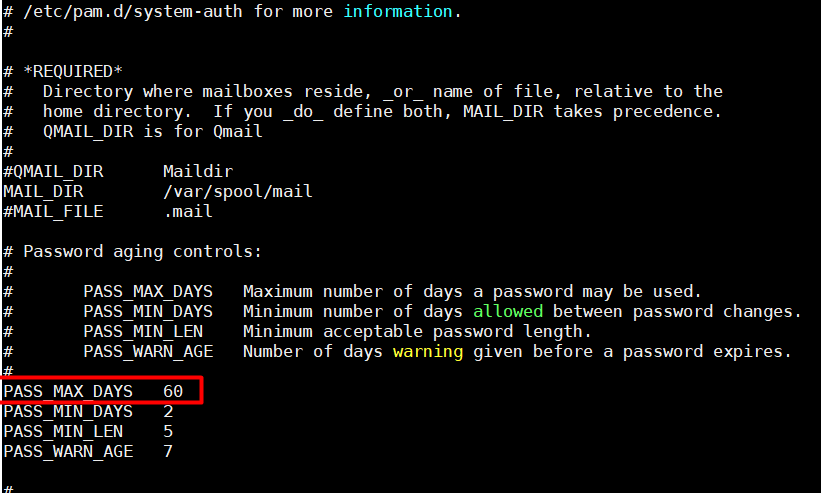
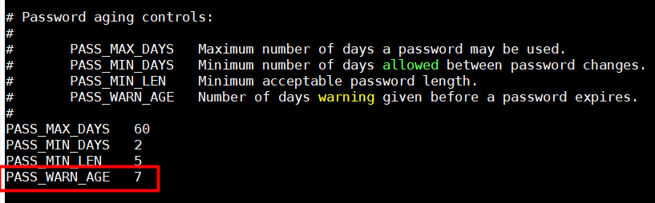

# Thiết lập mật khẩu an toàn trên Linux  
Tất cả các thiết lập về mật khẩu an toàn trên Linux đều được lưu tại file /etc/login.defs. Ta cấu hình file /etc/login.defs và thực hiện các chính sách về mật khẩu :  
1. Thiết lập số ngày hết hạn mật khẩu :  
- Số ngày mà người dùng phải thay đổi mật khẩu tính từ lần thay đổi password gần nhất .  
```
PASS_MAX_DAYS 60
```  
  
2. Thiết lập thời gian tồn tại của mật khẩu:  

- Khoảng thời gian ngắn nhất để có thể thay đổi password của một tài khoản :
```
PASS_MIN_DAYS 2
```  
  

3. Cảnh báo thời gian hết hạn :

Thiết lập số ngày cảnh báo trước khi mật khẩu hết hạn.
```
PASS_WARN_AGE 7
```  
  

- Tạo user mới và kiểm tra bằng lệnh :  

```
chage -l username
```  
  

## NOTE : 
- 3 thiết lập trên chỉ có thể áp dụng với những user mới . Những user cũ muốn thay đổi cần dùng lệnh `chage`  


4. Giới hạn mật khẩu đã được đặt trước đó
- Giới hạn  sử dụng password cũ. Người dùng không thể thiết lập password giống số password cũ được qui định. Ví dụ set remember bằng 5 sẽ không cho user dùng lại 5 password cũ đã đặt  
- Cấu hình bằng file `/etc/pam.d/system-auth` :  
```
password     sufficient     pam_unix.so sha512 shadow nullok try_first_pass
use_authtok remember=5
```   
5. Thiết lập độ dài mật khẩu ngắn nhất#

- Thiết lập độ dài ngắn nhất của mật khẩu. Người dùng không thể đặt mật khẩu ngắn hơn số ký tự quy định.

- Thiết lập mật khẩu ngắn nhất là 8 kí tự:
```
authconfig --passminlen=8 --update
```  
6. Thiết lập độ phức tạp trong password :  
- Trong Linux có các class kí tự như sau : UpperCase / LowerCase / Digits / Others. Độ phức tạp của mật khẩu được thiết lập theo số class xuất hiện trong mật khẩu.

- Cấu hình mật khẩu phải xuất hiện ít nhất 2 class:
```
authconfig --passminclass=2 --update
```  
7. Thiết lập số lần lặp kí tự :  

Thiết lập số lần lặp tối đa của một ký tự liền kề đối với password mới.

Cấu hình tối da cho phép 2 kí tự lặp nhau:  

```
authconfig --passmaxrepeat=2 --update
```  
8. Thiết lập độ phức tạp đối với mật khẩu mới.#

- Yêu cầu có ít nhất một ký tự thường :  
```
authconfig --enablereqlower --update
```   
- Yêu cầu có ít nhất một ký tự in hoa :  
```
authconfig --enablerequpper --update
```   
- Yêu cầu có ít nhất một ký tự số :  
```
authconfig --enablereqdigit --update
```  
9.  Thiết lập độ dài monotonic :  

- Monotonic trong toán học được gọi là hàm số đơn điệu, là một chuỗi các số tăng hoặc giảm trong khoảng. Ở đây cấu hình hình có thể được hiểu là các ký tự tăng hoặc giảm trong khoảng được định sẵn, ví dụ thiết lập là 3 thì chỉ có thể đặt mật khẩu là 123 hoặc abc , chứ không thể đặt chuỗi dài hơn với chữ cái hoặc số theo thứ tự dễ đoán trước (bảng chữ cái abc hay các số theo thứ tự tăng dần hoặc giảm dần ).

Cấu hình file /etc/security/pwquality.conf , thêm vào cuối file dòng sau  :  
```
maxsequence = 3
```   
  
10. Thiết lập số kí tự trong mật khẩu mới không được có trong mật khẩu cũ

- Để thiết lập số kí tự trong mật khẩu mới không được có trong mật khẩu cũ chúng ta làm như sau.

- Cấu hình file /etc/security/pwquality.conf , thêm vào cuối file dòng cấu hình sau:  

```
difok = 5
```  

11. Cấu hình danh sách các ký tự không được xuất hiện trong mật khẩu.  


- Để thiết lập danh sách các ký tự không được xuất hiện trong mật khẩu, chúng ta làm như sau.

- Đầu tiên, mở file /etc/security/pwquality.conf,thêm vào cuối file dòng cấu hình với những từ không được phép xuất hiện trong mật khẩu:
```
badwords = denywords1 denywords2 denywords3
```  

12. Cấu hình thuật toán băm/mã hóa cho mật khẩu mới.  

- Để thiết lập thuật toán băm/mã hóa cho mật khẩu mới chúng ta làm như sau, 
đầu tiên, kiểm tra thuật toán đang dùng hiện tại :  

```
authconfig --test | grep hashing
```  

- Thay đổi sang thuật toán mong muốn sử dụng, ở đây là SHA512  

```
authconfig --passalgo=sha512 --update
```  
>Các option có thể lựa chọn : descrypt , bigcrypt , md5 , sha256 , and sha512
