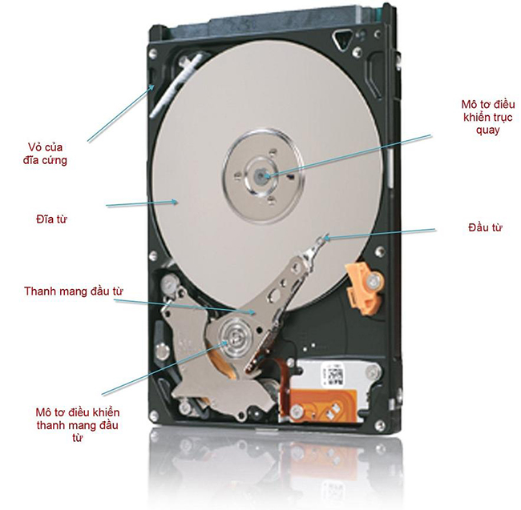
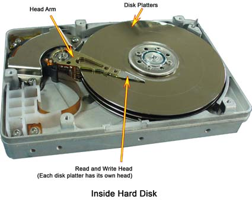
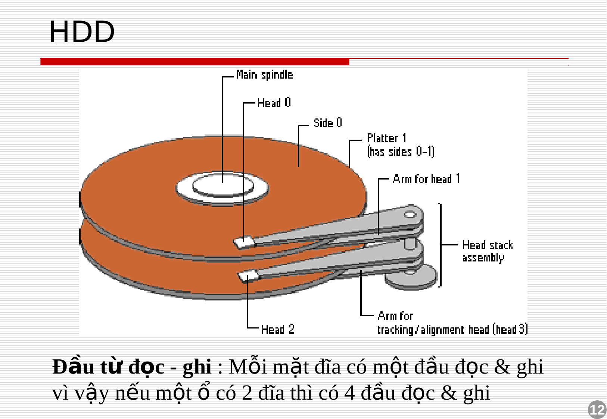

# CẤU TRÚC Ổ ĐĨA  
Ổ đĩa cứng, hay còn gọi là ổ cứng HDD( Hard Disk Drive ) là thiết bị dùng để lưu trữ dữ liệu trên bề mặt các tấm đĩa hình tròn phủ vật liệu từ tính. 
## 1. Cấu tạo :    
  

### Một ổ cứng bao gồm :   

## 1.1. Cụm đĩa :  

  

### Đĩa từ (platter) :  
- Đĩa thường cấu tạo bằng nhôm hoặc thuỷ tinh, trên bề mặt được phủ một lớp vật liệu từ tính là nơi chứa dữ liệu. Tuỳ theo hãng sản xuất mà các đĩa này được sử dụng một hoặc cả hai mặt trên và dưới. Số lượng đĩa có thể nhiều hơn một, phụ thuộc vào dung lượng và công nghệ của mỗi hãng sản xuất khác nhau.  
- Mỗi đĩa từ có thể sử dụng hai mặt, đĩa cứng có thể có nhiều đĩa từ, chúng gắn song song, quay đồng trục, cùng tốc độ với nhau khi hoạt động.     
    
###  Trục quay :  
- Trục quay là trục để gắn các đĩa từ lên nó, chúng được nối trực tiếp với động cơ quay đĩa cứng . Trục quay có nhiệm vụ truyền chuyển động quay từ động cơ đến các đĩa từ . Trục quay thường chế tạo bằng các vật liệu nhẹ (như hợp kim nhôm)
    
### Động cơ :    
- Yếu tố xác định chất lượng ổ cứng là tốc độ mà đĩa từ lướt qua dưới đầu đọc/ghi. Đĩa từ lướt qua đầu từ với tốc độ khá cao ( ít nhất là 3600 vòng/phút)  
- Mô tơ trục (spindle mô tơ) có chức năng làm quay các đĩa từ.
- Mô tơ trục là loại không có chổi quét, chiều cao thấp, dùng điện 1 chiều, tương tự mô tơ trong ổ đĩa mềm.
 
## 1.2. Cụm đầu đọc :  
  

  ### Đầu đọc (head) :  
-  Mỗi mặt đĩa có một đầu đọc/ghi  

  ### Cần di chuyển đầu đọc ( head arm) :    
  - Cần di chuyển đầu đọc/ghi là các thiết bị mà đầu đọc/ghi gắn vào nó. Cần có nhiệm vụ di chuyển theo phương song song với các đĩa từ ở một khoảng cách nhất định, dịch chuyển và định vị chính xác đầu đọc tại các vị trí từ mép đĩa đến vùng phía trong của đĩa (phía trục quay).    

## 1.3. Cụm mạch điện  :  
- Là mạch điện nằm phía sau ổ cứng, mạch này có các chức năng :  
     - Điều khiển tốc độ quay đĩa  
     
     - Điều khiển dịch chuyển các đầu từ  
     
     - Mã hoá và giải mã các tín hiệu ghi và đọc   
## 1.4. Võ đĩa :  
   - Chứa các linh kiện gắn trên nó, phần nắp đậy lại các bảo vệ linh kiện bên trong.
    - Vỏ đĩa cứng nhằm định vị các linh kiện, chịu đựng va chạm (ở mức thấp) để bảo vệ ổ đĩa cứng, không cho bụi vào trong ổ đĩa cứng.
   - Vỏ đĩa có lỗ thoáng nhằm đảm bảo cản bụi và cân bằng áp suất môi trường ngoài và môi trường trong.  

## 2. Cấu trúc đĩa từ (plate):  

  

- **Track** :  

  - Trên một mặt  của đĩa từ chia ra nhiều vòng tròn đồng tâm thành các track.  
  - Track có thể được hiểu đơn giản giống các rãnh ghi dữ liệu giống như các đĩa nhựa (ghi âm nhạc trước đây) nhưng sự cách biệt của các rãnh ghi này không có các gờ phân biệt và chúng là các vòng tròn đồng tâm chứ không nối tiếp nhau thành dạng xoắn trôn ốc như đĩa nhựa. Track trên ổ đĩa cứng không cố định từ khi sản xuất, chúng có thể thay đổi vị trí khi định dạng cấp thấp ổ đĩa (low format ). 
- **Sector** :    
    - Trên track chia thành những phần nhỏ bằng các đoạn hướng tâm thành các sector. Các sector là phần nhỏ cuối cùng được chia ra để chứa dữ liệu. Theo chuẩn thông thường thì một sector chứa dung lượng 512 byte.
    - Số sector trên các track là khác nhau từ phần rìa đĩa vào đến vùng tâm đĩa, các ổ đĩa cứng đều chia ra hơn 10 vùng mà trong mỗi vùng có số sector/track bằng nhau.   
- **Cylinder** :  
    - Tập hợp các track cùng bán kính ở các mặt đĩa khác nhau thành cylinder  

- **Cluster**  :  
    - Là một đơn vị lưu trữ 1 hoặc nhiều sector.
    - Khi lưu dữ liệu vào ổ cứng, các dữ liệu được ghi vào hàng chục, hàng trăm cluster liền kề hoặc không liền kề nhau. Nếu không có sẵn có cluster liền nhau, HĐH sẽ tìm kiếm cluster còn trống ở gần và ghi tiếp dữ liệu lên đĩa.  

    ## 3. IOPS , Latency và Throughput:    
### **Throughput**  
- Tốc độ transfer data của ổ cứng trên một đơn vị thời gian, thường được đo với đơn vị Megabytes/Second (MB/s) .  

### **Latency**  
- Thời gian ổ cứng bắt đầu thưc hiện 1 data transfer. Trong HDD vật lý truyền thống, latency bao gồm seek time (thời gian đầu đọc tìm ra vị trí data ) và rotational latency (độ trễ chuyển động quay của trục). Thông số latency quyết định hiệu năng của volume vì nó quyết định thời gian trễ khi bắt đầu thực hiện thao tác.

    - Seek time : Với ổ đĩa quay, seek time là khoảng thời gian để head di chuyển giữa các track. Hay nói cách khác là khoảng thời gian mà head cần có để di chuyển đến các track của đĩa quay nơi chứa dữ liệu sẽ được đọc hoặc ghi.
    - Rotatinal latency : Rotatinal latency  là thời gian mà đĩa của ổ cứng quay hết một vòng (Time per rotation) . Rotatinal latency phụ thuộc vào tốc độ quay của ổ đĩa, tốc độ quay càng cao thì latency sẽ càng giảm . Vì không phải lúc nào dữ liệu trên sector cũng ở ngay dưới đầu đọc head , đầu đọc phải đợi đĩa quay đến sector cần đọc.   


### **IOPS ( IO operations per second ):** 
- Số thao tác đọc ghi trên ổ cứng trong 1s . Thông số này cùng với IO Size sẽ tính được throughput  . IO size có thể là 4KB , 8KB ,... . Lượng data nhỏ nhất có thể đọc ghi là bằng 1 sector , 512 byte.  
Ta có công thức :  
```
Average IO size x IOPS = Throughput in MB/s
```


Đối với ổ HDD, IOPS được tính bởi công thức:
```
IOPS = 1/(seek + latency)
```  

## 4. Cách đọc ghi dữ liệu :  
- Có 2 cách  là random và sequential (ngẫu nhiên và tuần tự ) :  
- Random Access:

    - Là hành động truy xuất ngẫu nhiên bất kì trên ổ đĩa bất kể số lượng và kích thước bao nhiêu. Random Access còn được gọi là Direct Access , do hệ thống biết được data lưu ở đâu và có thể di chuyển thanh ghi ổ cứng đến track để đọc dữ liệu .
    - Hiện tại Các ổ HDD viết và đọc theo cách này .  

- Sequential Access :

    - Truy xuất dạng tuần tự là hành động truy cập vào một nhóm các vùng nhớ được xác định trước, theo 1 thứ tự sắp xếp trên ổ đĩa.  

- So sánh :  
   - Dữ liệu đọc ghi theo kiểu sequential nhanh hơn , do luôn đọc và ghi một cách tuần tự . Tuy nhiên Random access giúp tìm kiếm dữ liệu nhanh hơn .  
   - Kiểu Sequential không phù hợp hiện nay do thời gian tìm kiếm quá lâu , nhưng vẫn hữu dụng trong việc di chuyển một lượng lớn data . Lợi thế duy nhất của ghi tuần tự là việc truy cập vào một file lớn dễ dàng hơn do ghi tuần tự và ở cách nhau . Tuy nhiên lợi thế này mất đi khi data lớn hiện giờ cần lưu trữ thành nhiều mảnh nhỏ hơn . Ví dụ như các database lớn thường được truy cập nhanh hơn nếu được lưu trữ ngẫu nhiên , còn nếu chạy theo kiểu tuần tự sẽ phải load tất cả các database . 
   - Kiểu ghi random có lợi thế hơn do data sẽ được đưa vào bất kì chỗ nào còn trống trong ổ cứng , điều này có lợi hơn khi dữ liệu thường xuyên bị modified .  
   


