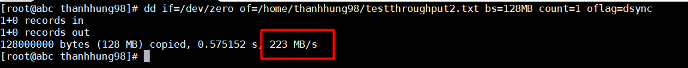
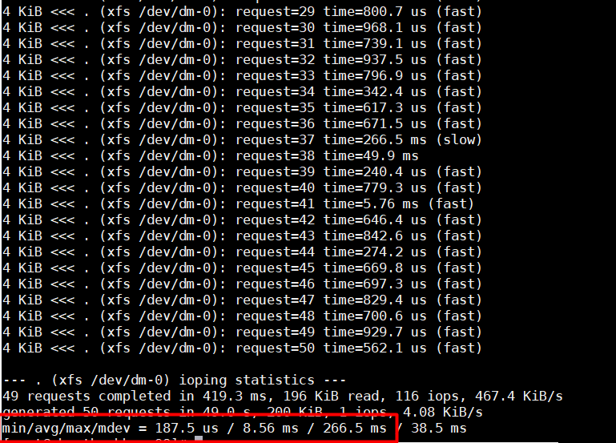
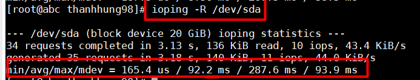
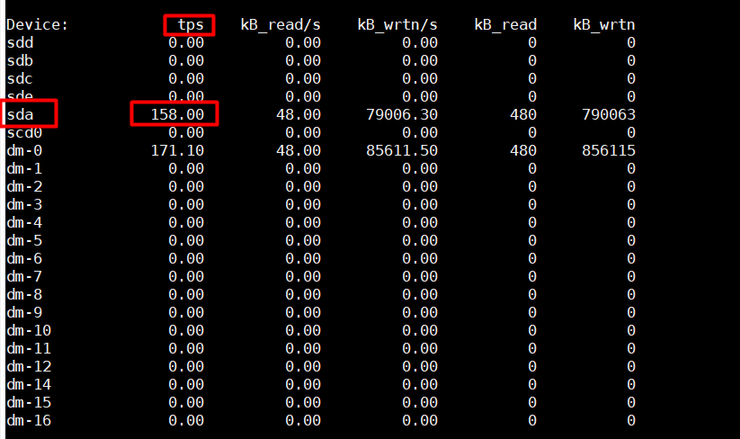
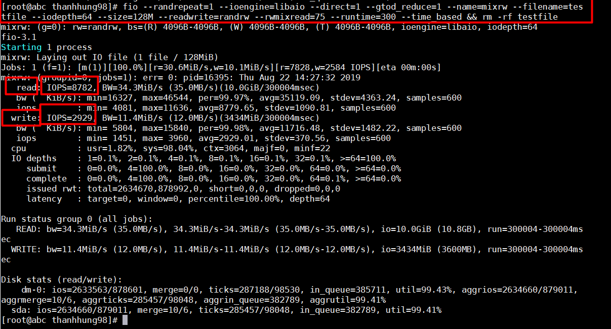

# KIỂM TRA THÔNG SỐ Ổ CỨNG

## 1. Kiểm tra throughput
- Lệnh :  
```
dd if=/dev/zero of=/home/thanhhung98/testthroughput2.txt bs=128MB count=1 oflag=dsync
```  
>Trong đó :  
>if : Tên input file để đọc dữ liệu .  
>of : tên output file mà ta muốn ghi dữ liệu từ input file
>bs : kích thước các block để ghi . 
>count : số block đọc   

  
Ta thấy ở đây ghi 128MB vào ổ đĩa với throughput là 223 MB/s  


## 2. Kiểm tra latency :
- Lệnh kiểm tra latency :    
```
ioping -c 50 .
```  
  

- Kiểm tra seek time :  
```
ioping -R /dev/sda
```  


## 3. Kiểm tra IOPS :  
- Cách 1 :  

```
iostat 10
```  


- Sau 10s màn hình sẽ reset một lần .Ta thử ghi dữ liệu vào và thấy mục tps Transaction per sec (hay còn gọi là IOPS)  thay đổi .  

- Cách 2 :  
```
fio --randrepeat=1 --ioengine=libaio --direct=1 --gtod_reduce=1 --name=mixrw --filename=testfile --iodepth=64 --size=4G --readwrite=randrw --rwmixread=75 --runtime=300 --time_based && rm -rf testfile
```  

> Kiểm tra với tỉ lệ 75%/25% read/write , đây là thông số phổ biến xấp xỉ với các database hiện nay .  
> - Trong đó :   
>   - filename : Tên file 
>   - readwrite : Kiểu đọc ghi của ổ địa ( Random hoặc sequential) , tùy chọn randrw là  đọc và ghi ngẫu nhiên
>   - rwmixread : Tỉ lệ đọc khi các tác vụ đọc ghi diễn ra ( ở đây là 75% tác vụ sẽ dành cho đọc )  
>   - runtime : Giới hạn hời gian fio thực hiện các quá trình I/O
>   - size : Kích thước file thực hiện quá trình .

    

- Ta thấy ổ cứng ghi 128 MB với thời gian 300s , gồm 8782 tác vụ đọc và 2929 tác vụ ghi mỗi giây.
